 ### 01.JVM中有哪几块内存区域？Java 8 之后对内存分代做了什么改进？

**JDK1.8之前：**

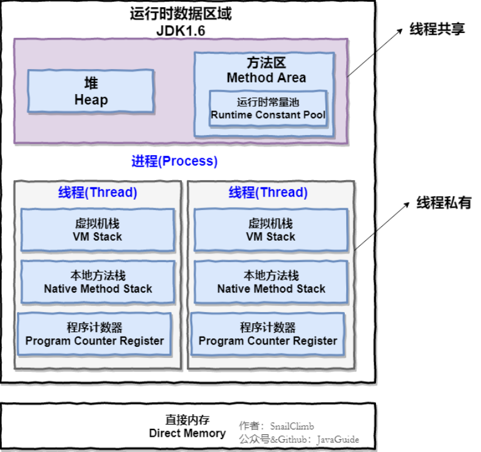

**JDK 1.8：**

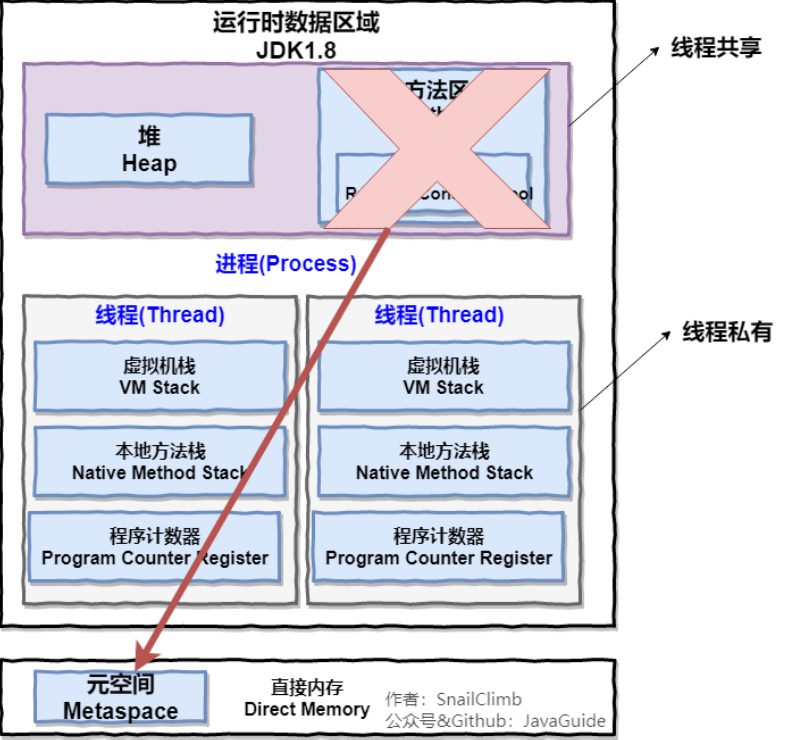

**线程私有的：**

- 程序计数器
- 虚拟机栈
- 本地方法栈

**线程共享的：**

- 堆
- 方法区
- 直接内存（非运行时数据区的一部分）

**1.程序计数器**

程序计数器是一块较小的内存空间，可以看作是当前线程所执行的字节码的行号指示器。字节码解释器工作时通过改变这个计数器的值来选取下一条所需执行的字节码指令，分支、循环、跳转、异常处理、线程恢复等功能都需要依赖这个计数器来完成。另外，为了线程切换后恢复到正确的执行位置，每条线程都需要一个独立的程序计数器，个线程之间计数器互不影响，独立存储，我们称这类内存区为“线程私有”的内存。

从以上介绍得知程序计数器主要有两个作用：

1. 字节码解释器通过改变程序计数器来依次读取指令，从而实现代码的流程控制，如：顺序执行、选择、循环、异常处理。
2. 在多线程的情况下，程序计数器用于记录当前线程指令的位置，从而当线程被切换回来的时候能够知道该线程上次运行到哪了。

**2.Java虚拟机栈**

与程序计数器一样，Java虚拟机栈也是线程私有的，生命周期与线程相同，随着线程创建而创建，死亡而死亡（线程周期：新建（New），就绪（Runnable），运行（Running），阻塞（Blocked），死亡（Dead）），**描述的Java方法执行的内存模型**，每次方法调用的数据都是通过栈传递。

Java内存可以粗糙的区分为堆内存（Heap）和占内存（Stack），其中栈就是现在说的虚拟机栈，或者说是虚拟机栈中局部变量表部分。（实际上，Java虚拟机栈是有一个栈帧组成，每个栈帧中都拥有：局部变量表、操作数栈、动态链接、方法出口信息。）

局部变量表主要存放编译器可知的各种数据类型（boolean、byte、char、short、int、float、long、double）、对象引用（reference类型，它不同于对象本身，可能是一个指向对象起始地址的引用指针，也可能是一个代表对象的句柄或者其他与此对象相关位置）。

java虚拟机栈会出现两种异常：StackOverFlowError和OutOfMemoryError：

- StackOverFlowError：若Java虚拟机栈的内存大小不允许动态扩展，那么当线程请求栈的深度超过当前Java虚拟机栈的最大深度的时候就抛出此异常。
- OutOfMemoryError：若Java虚拟机栈的内存大小允许扩展，且当前请求占内存用完了，无法在动态扩展了，此时抛出OutOfMemoryError异常。

扩展：那么方法/函数如何调用？

Java栈可用类比数据结构中栈，Java栈中保存的主要内容是栈帧，每次函数调用都会有一个相应的栈帧被压入Java栈，每一个函数调用结束后，都会有一个栈帧被弹出。

Java方法有两种返回方式：

1. return语句
2. 抛出异常

不管是那种返回方式都会导致栈帧被弹出。

**3.本地方法栈**

和虚拟机栈所发挥的作用非常相似，区别是：虚拟机栈为虚拟机执行Java方法（也就是字节码）服务，二本地方法栈责问虚拟机使用到的Native方法服务，在HostSpot虚拟机中和Java虚拟机栈合二为一。

本地方法被执行的时候在本地方法栈也会创建一个栈帧，用于存放该本地方法的局部变量表、操作数栈、动态链、出口信息。

方法执行完毕后相应的栈帧也会出现栈并释放内存空间，也会出现StackOverFlowError和OutOfMemoryError两种异常。

**4.堆**

Java虚拟机所管理的内存中最大的一块，Java堆是所有线程共享的一块区域，在虚拟机启动时创建。此内存的**唯一 目的就是存放对象实例**，几乎所有的对象实例以及数组都在这里分配内存。

Java堆是垃圾收集器管理的主要区域，因此也被称作GC堆（Garbage Collected Heap）。从垃圾回收的角度，由于现在收集器基本采用的是粉黛垃圾收集算法，所以Java堆还可以细分为：**新生代和老年代**：再细致店：Eden空间、From Survivor、To Survivor空间等。**进一步划分的目的是更好的回收内存，或者是更快速的分配内存**。

上图所示的eden区、s0区、s1区都属于新生代，tentired属于老年代。大部分情况下，对象都会首先在Eden区域分配，在一次新生代垃圾回收后，如果对象还存活，则会进入S1或者S0，并且对象的年龄还会加1（eden区->survivor区后对象的初始年龄变为1），当它的年龄增加到一定程度（默认为15）就会被晋升到老年代中。对象到老年代的年龄阈值，可以通过参数-XX:MaxTenuringThreshold来设置。（两个Survivor的存在意义，就是减少被送到老年代的对象，进而减少Full GC的发生，Survivor的预筛选保证，只有经历16次Minor GC还能在新生代中存活的对象，才会被送到老年代。）

**5.方法区**

方法区与Java堆一样，是各个线程共享的内存区域，它用于存储已被虚拟机加载的类信息、常量、静态变量、即时编译器编译后的代码等数据。虽然Java虚拟机规范把方法区描述为堆一个逻辑部分，但是它却有一个别名叫做**Non-Heap（非堆）**,目的应该是与Java堆区分开来。

方法区也被称为永久代，两者关系如下：

方法区和永久代的关系就像Java中接口和类的关系，类实现了接口，**永久代就是对方法区的一种实现方式**。JDK1.8之后永久代被彻底移除，取而代之是元空间，元空间使用使用的是直接内存

**为什么要将永久代(PermGen)替换为元空间(MetaSpace)呢?**
整个永久代有一个JVM本身设置固定大小上线，无法进行调整，而元空间使用的是直接内存，受本机可用内存的限制，并且永远不会得到java.lang.OutOfMemoryError.你可以使用-XX: MaxMetaspaceSize标志设置最大元空间大小，默认值为unlimited,这意味着它只受系统内存的限制。-XX: MetaspaceSize 调整标志定义元空间的初始大小，如果未指定此标志，则Metaspace将根据运行时的应用程序需求动态地重新调整大小。

**运行时常量池**

运行时常量池时方法区的一部分，Class文件除了有类的版本、字段、方法、接口等描述信息外，还有常量池信息（用于存放编译器生成的各种字面量和符号引用），JDK1.7之后JVM已经将运行时常量池从方法区移了出来，在Java堆（Heap）中开辟了一块区域存放运行时常量池。换地方后则不受方法区内存的限制，避免了当常量池无法申请内存时抛出OutOfMemoryError异常

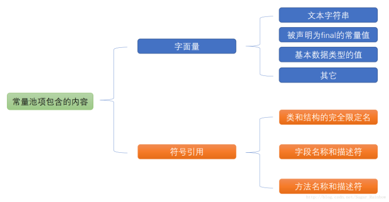

**直接内存**

直接内存并不是虚拟机运行时数据区的一部分，也不是虚拟机规范中定义的内存区域，但是这部分内存也被频繁的使用，可能导致OutOfMemoryError异常出现。

JDK1.4中新加入的NIO（New Input/Output）类，引入了一种基于通道（Channel）与缓存区（Buffer）的I/O方式，它可以直接使用Native函数库直接分配堆外内存，然后通过一个存储在Java堆中的DirectByteBuffer对象作为这块内存的引用进行操作。这样在一些场景提高性能，因为避免了在Java堆和Native堆之间来回复制数据。

本机直接内存的分配不会受到Java堆的限制，但是既然时内存就会收到本机总内存大小以及处理器寻址空间的限制。

 ### 02.你知道JVM是如何运行起来的吗？堆内存中对象的分配的基本策略？

堆空间的基本结构：

新生代：eden区、s0区、s1区  默认大小分配8：1：1

老年代：tentired区

**Minor Gc（新生代垃圾回收）和Full/Major Gc（老年代垃圾回收）有什么不同？**

大多数情况下，对象在新生代中eden区分配。当Eden区没有足够的空间进行分配时，虚拟机将发起一次Minor Gc。

- 新生代GC：指发生新生代的垃圾收集动作，Minor GC非常频繁，回收速度一般比较快
- 老年代Gc：指法伤在老年代的GC,出现Major GC经常会伴随至少一次Minor GC(并非绝对)，Major GC的速度一般会比MinorGC慢10倍以上。

 ### 03.说说JVM在哪些情况下会触发垃圾回收可以吗？

1. 执行 system.gc()的时候
2. 老年代空间不足，一次Full GC 之后，然后不足 会触发 java.outofmemoryError:java heap space
3. 永久代空间不足 ， java.outofMemory  PerGen Space
4. minor之后 survior  survivor放不下，放入老年代，老年代也放不下，触发FullGC, 或者新生代有对象放入老年代，老年代放不下，触发FullGC
5. 新生代晋升为老年代时候，老年代剩余空间低于新生代晋升为老年代的速率，会触发老年代回收
6. new 一个大对象，新生代放不下，直接到老年代，空间不够，触发FullGC

**如何避免频繁GC**

不要频繁的new 对象；不要显示的调研system.gc()；不要使用Long Integer 尽量使用基本类型；少用静态变量 不会回收；可以使用null 进行回收

 ### 04.对象什么时候转移到老年代？

1、长期存活对象（s0与s1之间转移次数达到15次）

2、S区放不下的对象

3、大对象

### 05.垃圾收集算法有哪些，以及各自的特点？

**标记-清除算法**

算法分为“标记”和“清除”阶段：首先标记出所有需要回收的对象，在标记完成后同一回收所有被标记的对象。他是最基础的收集算法，后续算法都是对其不足改进得到的。这种算法有两个明显问题：

1. 效率问题
2. 空间问题（标记清除后产生大量不连续的碎片）

图解：

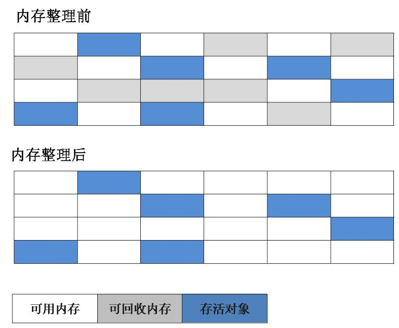

------

**复制算法**

为了解决效率问题，“复制”收集算法出现了。他可以将内存分为大小相同的两块。每次使用其中一块。当这一块的内存使用完后，就将还存活的对象复制到另一块去，然后把使用的空间一次性清理掉。这样就使用每次的内存回收都是对内存区间的一半进行回收。

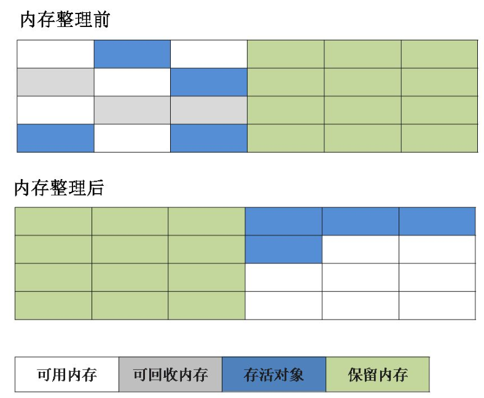

------

**标记-整理算法**

根据老年代的特点而设计的算法，标记过程仍然与“标记-清除”算法一样，但后续步骤不是直接对可回收对象回收，而是让所有存活的对象响一端移动，然后直接清理掉端边界以外的内存。

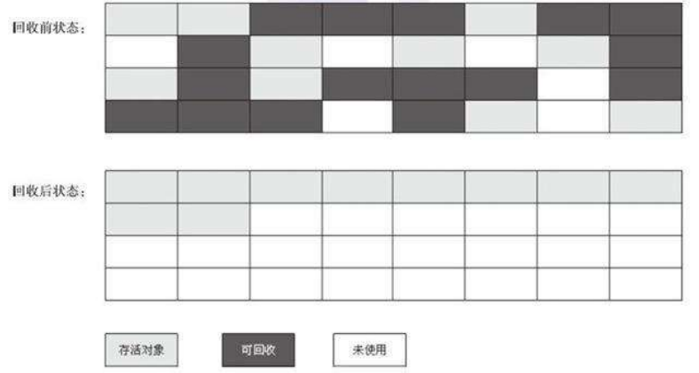

------

**分代收集算法**

当前虚拟机的垃圾收集都采用分代收集算法，这种算法没有什么新思想，只是根据对象存活周期的不同将内存分为几块。一般将Java堆分为新生代和老年代，这样可以根据年代的特点选择合适垃圾收集算法。

比如在新生代中，每次收集都会有大量对象死去，所以可以选择复制算法，只需要付出少量对象的复制就可以完成每次垃圾收集。而老年代的对象存活几率时比较高的，而且额外的空间对它进行分配担保，所以我们必须选择“标记-清除”或者“标记整理”算法来进行垃圾收集。

###  06.HotSpot为什么要分为新生代和老年代？

主要为了提升GC效率。上面的分代收集算法已经很好的解释了这个问题。

### 07.常用的垃圾回收器都有什么？

**如果说收集算法时内存回收的方法论，那么垃圾收集器就是内存回收的具体实现。**

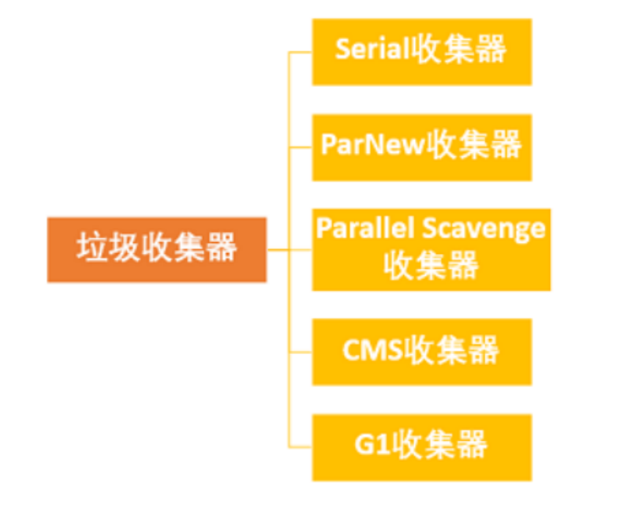

**Serial收集器**

Serial（串行）收集器收集是最基本、历史最悠久的垃圾收集器了。是一个单线程收集器，它的“单线程”的意义不仅仅意味着他只会使用一条垃圾收集线程去完成垃圾收集工作，更重要的是它在垃圾收集工作的时候必须暂停其他所有工作线程（**Stop The World**），知道它收集结束。这一缺点带来不良用户体验，但他也有优点简单高效（与其他收集器的单线程相比）。Serial收集器由于没有线程交互的开销，自然可以获得很高的单线程收集效率。

新生代采用复制算法，老年代采用标记-整理算法。Serial收集器适用于运行在Client模式下的虚拟机。

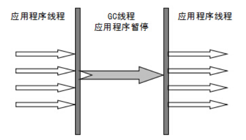

------

**Serial Old收集器**

Serial收集器的老年代版本，单线程收集器。两大用途：一适用于JDK1.5以及以前的版本中于Parallel Scavenge收集器搭配使用，另一种作为CMS收集器的后备方案。

**ParNew收集器**

ParNew收集器其实就是Serial收集器的多线程版本，除了使用多线程进行垃圾收集外，其余行为（控制参数、收集算法、回收策略等）和Serial收集器完全一样。新生代采用复制算法，老年代采用标记-整理算法。ParNew收集器适用于运行在Server模式下的虚拟机。

**并行和并发概念补充**

- 并行（Parallel）：指多条垃圾收集线程并行工作，但此时用户线程扔出去等待状态。
- 并发（Concurrent）：指用户线程与垃圾收集线程同时执行（但不一定是并行，可能回事交替执行），用户程序在继续运行，而垃圾收集器运行在另一个CPU上。

------

**Parallel Scavenge收集器**

Parallel Scavenge收集器类似于ParNew收集器。

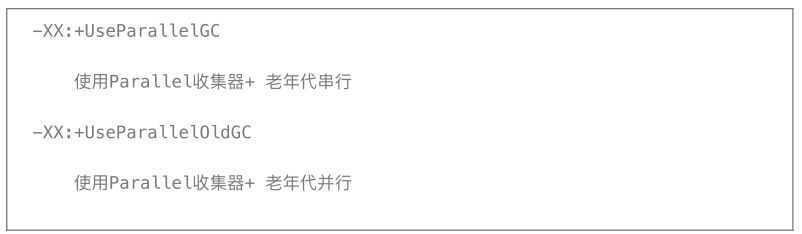

Parallel Scavenge收集器关注点时吞吐量（高效率的利用CPU）。CMS等垃圾收集器关注点更多是用户线程的停顿时间（提高用户体验）。所谓吞吐量就是CPU中用于用户代码的时间于CPU总消耗时间的比值。新生代采用复制算法，老年代采用标记-整理算法。

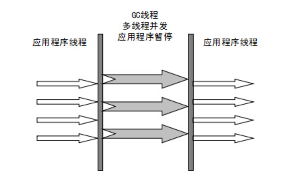

------

**Parallel Old收集器**

Parallel Scavenge收集器的老年代版本。使用多线程和“标记-整理”算法。在注重吞吐量以及CPU资源的场合都和使用。

------

**CMS收集器**

CMS（Concurrent Mark Sweep）收集器是一种以获取最短回收停顿时间为目标的收集器。注重用户体验。

CMS收集器时HotSpot虚拟机第一款真正意义上的并发收集器，第一次实现了让垃圾收集线程与用户线程（基本上）同时工作。

从名字 Mark Sweep可以看出，CMS是一种“标记-清除”算法实现的，运作过程分为四个部分：

- 起始标记：暂停所有的其他线程，并记录下直接与root相连的线程的对象，速度很快；
- 并发标记：同事开启GC和用户线程，用一个闭包结构去记录可达对象。但在这个阶段，闭包结构并不能保证包含当前所有的可达对象。因为用户线程可能会不断的更新引用域，所以GC线程无法宝成可达性分析的实时性。所以这个算法里会跟踪记录这这发生引用更新的地方。
- 重新标记：重新标记为了修正并发标记期间因为用户程序继续运行而导致标记产生变动的那一部分的标记记录，在这个阶段的停顿时间都会比初始标记阶段的时间稍长，远远比并发阶段时间短。
- 并发清除：开启用户线程，同事GC线程开始对位标记的区域做清扫。

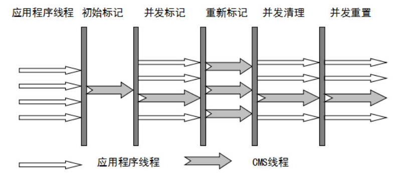

主要优点：并发收集、低停顿。但也有缺点：

- 对CPU资源敏感
- 无法处理浮动垃圾
- 它使用的回收算法“标记-清除”算法会导致收集结束时产生大量空间碎片。

------

**G1收集器**

G1是一款面向服务器的垃圾收集器，主要针对配备多颗处理器及大容量内存的集器，以极高概率满足GC听段时间要求的同步时，还具备高吞吐量新能特征，被视为JDK1.7中HotSpot虚拟机的一个重要进化特征，特点如下：

- 并行与并发：G1能充分利用CPU、多核环境下的硬件优势，使用多个CPU（CPU或者CPU核心）来缩短Stop The World停顿时间，部分其他收集器原本需要停顿Java线程执行的GC动作，G1收集器仍然可以通过高并发的方式让Java程序继续执行。
- 分代收集：虽然G1可以不需要其他收集器配合就可以独立管理整个GC堆，但是还是保留了分代概念。
- 空间整合：与CMS的“标记-清理”算法不同，G1整体看着基于“标记整理”算法实现的 收集器，从局部看上去基于“复制“算法实现的。
- 可预测停顿：降低停顿时间是G1与CMS共同关注点，但G1处理追求低停顿外，还能建立可预测的停顿时间模型，能让使用者明确指定在一个长度位M毫秒的时间片段内。

G1收集器的运作步骤如下：

- 初始标记
- 并发标记
- 最终标记
- 筛选回收

G1收集器在后台维护了一个优先列表，每次根据允许的收集时间，优先选择回收价值最大的Region。这种使用Region划分内存空间以及有优先级的区域回收方式，保证了GF收集器在有限时间内可以尽可能高的收集效率（把内存化整为零）。

 ### 06.你们生产环境中的Tomcat是如何设置JVM参数的？如何检查JVM运行情况的？

 ### 07.你在实际项目中是否做过JVM GC优化，怎么做的？

### 08.谈谈你对java跨平台性的理解？为什么java可以一次编译到处运行？
