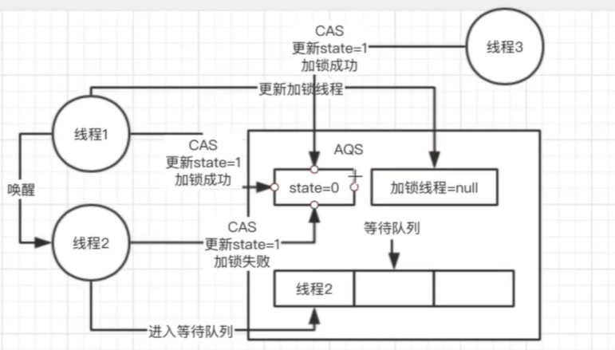
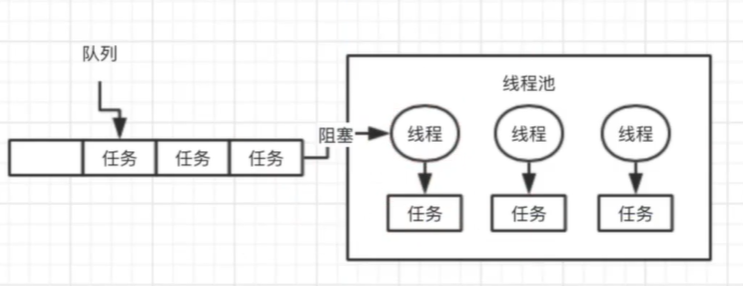
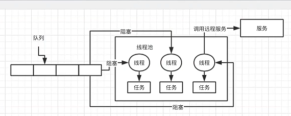
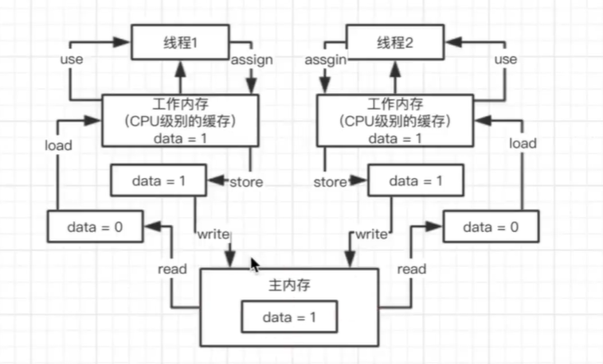

### 01. Java SE多线程基础回顾


###  02. synchronized关键字的底层原理以及跟lock锁之间的区别？

使用了synchronized关键字，在底层编译后的jvm指令中，会有monitorenter和monitorexit 两个指令。

那么monitorenter指令执行的时候会干什么呢？

每个对象都有关联的monitor，如果要对这个对象加锁，就必须获取这个对象关联的monitor的lock锁。
monitor里面的原理和思路大概是这样的，monitor里面有一个计数器，从0开始。如果一个线程要获取monitor的锁，就会判断他的计数器是不是0，如果是0，那么说明没有人获取锁，他就可以获取锁，然后对计数器加一。同理释放锁的时候就会减一。
如果一个线程来获取montior锁时发现，值不是0，这个线程就会陷入阻塞状态，就会等待计数器变成0然后执行。

注意monitor的锁是支持重复加锁的，就像下面这段代码

```java
加一次锁monitor计数器就会加一 释放一次就会减一 一直到0表示锁为可以获取的状态
synchronized(myObject){
	//一大堆代码
	synchronized(myObject){
	}
}

```


如上图，线程1来时，对象中的monitor对象为0 则可以执行，当线程2 访问时monitor为1 说明此时已有线程在使用，则加锁失败进入阻塞等待的状态，当线程1结束时monitor则变为0 此时线程2执行。

synchronized与lock的区别


###  03.聊聊你对CAS的理解以及底层实现原理？

CAS（博客地址➡）：[什么是CAS机制](https://blog.csdn.net/qq_32998153/article/details/79529704?depth_1-utm_source=distribute.pc_relevant.none-task-blog-BlogCommendFromBaidu-1&utm_source=distribute.pc_relevant.none-task-blog-BlogCommendFromBaidu-1)

下面是我对CAS的理解和总结：Compare And Swap（比较和交换）
首先说一说CAS能解决的问题。我们都知道当多个线程对同一个数据进行操作的时候，如果没有同步就会产生线程安全问题。为了解决线程线程安全问题，我们需要加上同步代码块，操作，如加上synchronized。但是某些情况下这并不是最优选择。

synchronized关键字会让没有得到锁资源的线程进入BLOCKED状态，而后在争夺到锁资源后恢复为RUNNABLE状态，这个过程中涉及到操作系统用户模式和内核模式的转换，代价比较高。这个过程是一个串行的过程，效率很低。
尽管JAVA 1.6为synchronized做了优化，增加了从偏向锁到轻量级锁再到重量级锁的过过度，但是在最终转变为重量级锁之后，性能仍然比较低。所以面对这种情况，我们就可以使用java中的“原子操作类”。

而原子操作类的底层正是用到了“CAS机制”。

CAS是英文单词Compare and Swap的缩写，翻译过来就是比较并替换。
CAS机制中使用了3个基本操作数：内存地址V，旧的预期值A，要修改的新值B。

更新一个变量的时候，只有当变量的预期值A和内存地址V当中的实际值相同时，才会将内存地址V对应的值修改为B。(具体实现详细的见上面的博客中介绍）

从思想上来说，synchronized属于悲观锁，悲观的认为程序中的并发情况严重，所以严防死守，CAS属于乐观锁，乐观地认为程序中的并发情况不那么严重，所以让线程不断去重试更新。

说了这么多，CAS是否是完美的呢，答案也是否定的。下面是说一说CAS的缺点：

1） CPU开销过大

在并发量比较高的情况下，如果许多线程反复尝试更新某一个变量，却又一直更新不成功，循环往复，会给CPU带来很到的压力。

2） 不能保证代码块的原子性

CAS机制所保证的知识一个变量的原子性操作，而不能保证整个代码块的原子性。比如需要保证3个变量共同进行原子性的更新，就不得不使用synchronized了。

3） ABA问题

这是CAS机制最大的问题所在。


###  04. ConcurrentHashMap实现线程安全的底层原理是什么？

**ConcurrentHashMap的数据结构**（数组+链表+红黑树），桶中的结构可能是链表，也可能是红黑树，红黑树是为了提高查找效率。

jdk1.7：Segment+HashEntry来进行实现的；

jdk1.8：摒弃了Segment的概念，而是直接用Node数组+链表+红黑树的数据结构来实现，并发控制使用Synchronized和CAS来操作，整个看起来就像是优化过且线程安全的 (ConcurrentHashMap的数据结构（数组+链表+红黑树），桶中的结构可能是链表，也可能是红黑树，红黑树是为了提高查找效率。)

首先聊一聊ConcurrentHashMap存在的必要性，即它能解决的问题。在编程中我们常常要对一个hashMap进行多个线程的操作，这个时候为了避免线程安全问题，我们就要给她加上同步。
但是这个时候又会有新的问题产生。

```java
我们知道hashMap的底层实现实际上是数组
多个线程过来，线程1要put的位置是数组[5]，线程二要put的位置是[21]
synchronized(map){
	map.put(xxx,xxx)
	}

```

我们可以看到向两个不同的位置添加元素，也被锁管理了，这明显是没有必要的，会造成效率低下。我们需要解决这个问题。JDK并发包里推出了ConcurrentHashMap，默认实现了线程的安全性。

下面聊一聊，它是如何实现的。

在JDK 1.7 版本，它的实现方式是分段加锁，将HashMap在底层的数组分段成几个小数组，然后给每个数组分别加锁。

JDK1.8以及之后，做了一些优化和改进，锁粒度的细化。

这里仍然是一个大的数组，数组中每个元素进行put都是有一个不同的锁，刚开始进行put的时候，如果两个线程都是在数组[5]这个位置进行put，这个时候，对数组[5]这个位置进行put的时候，采取的是CAS策略。
同一时间，只有一个线程能成功执行CAS，其他线程都会失败。
这就实现了分段加锁的第一步，如果很多个线程对数组中不同位置的元素进行操作，大家是互相不会影响的。

如果多个线程对同一个位置进行操作，CAS失败的线程，就会在这个位置基于链表+红黑树来进行处理，synchronized([5]),进行加锁。

综上所述，JDK1.8之后，只有对相同位置的元素操作，才会加锁实行串行化操作，对不同位置进行操作是并发执行的()

###  05. 对JDK中的AQS了解吗？AQS的实现原理是什么？

多线程同时访问一个共享数据可以用sychronized，CAS，ConcurrentHashMap，同时也可以用本小节学的Lock，他的底层基于AQS技术。Abstract Queued Synchronizer简称为AQS，抽象队列同步器。

```java
在创建锁时候 可以创建公平锁和非公平锁
创建非公平锁
ReentrantLock lock = new ReentrantLock();//非公平锁
创建公平锁
ReentrantLock lock = new ReentrantLock(true);//公平锁
lock.lock();

lock.unlock();
```

非公平锁，当线程 1结束运行释放锁以后，线程1唤醒线程2（此时线程2位于等待队列），还没等线程2 CAS成功，此时冒出线程3插队直接加锁，则线程2失败，继续进入等待队列。

公平锁，按照上述场景，当3来时先回判断等待队列是否有线程 有则无法插队进入等待队列。



###  06.说说线程池的底层工作原理？

首先说一说为什么要有线程池（优点）。

系统是不可能频繁的创建线程又销毁线程的，这样会非常影响性能，所以我们需要线程池，优点如下：

第一：降低资源消耗。通过重复利用已创建的线程降低线程创建和销毁造成的消耗。

第二：提高响应速度。当任务到达时，任务可以不需要等到线程创建就能立即执行。

第三：提高线程的可管理性。线程是稀缺资源，如果无限制地创建，不仅会消耗系统资源，

创建线程池

```jav
 ExecutorService threadPool = Executors.newFixedThreadPool(3);//corePoolSize=3
        threadPool.submit(new Callable<>() {

            @Override
            public Object call() throws Exception {
                return null;
            }
            
        });

```

**执行原理：**（ 创建线程池时，线程池里面是没有线程的。）提交任务后，会首先判断线程池中的线程的数量是否小于corePoolSize（也就是上面的3），如果小于，就会创建一个线程来执行这个任务。

当任务来时，先判断线程池里面是否有空闲线程，有空闲线程则提交任务，知道当线程数量等于corePoolSize，无则在队列阻塞等待，（如果阻塞队列满了，那就创建新的线程执行当前任务，直到线程池中的线程数达到maxPoolSize，这时再有任务来，由饱和（拒绝）策略来处理提交的任务）



###  07.说说线程池的核心配置参数是干什么的？应该怎么用？

 ```jav
当我们调用上一节的函数生成fixed线程池的时候
ExecutorService threadPool = Executors.newFixedThreadPool(3);
它的底层执行的代码如下
return new ThreadPoolExecutor(
		nThreads,//corePoolSize
        nThreads,//maximumPoolSize(当线程到达corePoolSize，且等待队列满 则可继续创建直到=max...,当任务执行完后，等待设定的等待时间，此期间若无任务提交 则会销毁）
        long keepAliceTime,//表示等待的时间
        TimeUint.MiLLISECONDS,//代表keepAliceTime（等待时间）单位为毫秒
        new LinkedBlockingQueue<Runnable>(n),//设置线程池放任务的等待队列的个数为n
        RejectedExecutionHandler handler); //饱和策略

 ```


###  08. 如果在线程中使用无界阻塞队列会发生什么问题？等同于问，在远服务异常的情况下，使用无界阻塞队列，是否会导致内存异常飙升？



调用超时，队列变的越来越大，此时会导致内存飙升起来，而且还可能会导致内存溢出。

###  09.线程池的队列满了之后，会发生什么？

如果使用的是无界队列 LinkedBlockingQueue，也就是无界队列的话，没关系，继续添加任务到阻塞队列中等待执行，因为 LinkedBlockingQueue 可以近乎认为是一个无穷大的队列，可以无限存放任务

如果使用的是有界队列比如 ArrayBlockingQueue，任务首先会被添加到ArrayBlockingQueue 中，ArrayBlockingQueue 满了，会根据maximumPoolSize 的值增加线程数量，如果增加了线程数量还是处理不过来，ArrayBlockingQueue 继续满，那么则会使用拒绝策略RejectedExecutionHandler 处理满了的任务，默认是 AbortPolicy

**四种饱和(拒绝)策略：**

ThreadPoolExecutor.**AbortPolicy**:丢弃任务并抛出RejectedExecutionException异常。 ThreadPoolExecutor.**DiscardPolicy**：丢弃任务，但是不抛出异常。 ThreadPoolExecutor.**DiscardOldestPolicy**：丢弃队列最前面的任务，然后重新提交被拒绝的任务 ThreadPoolExecutor.**CallerRunsPolicy**：由调用线程（提交任务的线程）处理该任务

###  10.如果线上机器突然宕机，线程池的阻塞队列中的请求怎么办？

必然会导致线程池中积压的任务（等待队列中的任务）都会丢失。

如何解决这个问题呢？

我们可以在提交任务之前，在数据库中插入这个任务的信息，更新任务的状态：未提交、已提交、已完成。提交成功后，更新它的状态是已提交状态。

系统重启后，用一个后台线程去扫描数据库里的未提交和已提交状态的任务，可以把任务的信息读取出来，重新提交到线程池里去，继续进行执行。

###  11.谈谈对JAVA内存模型的理解？

read(读取)、load(载入)、use(使用)、assign(赋值)、store(存储)、write(写入)

- **lock（锁定）**：作用于主内存中的变量，它把一个变量标识为一条线程独占的状态。
- **unlock（解锁）**：作用于主内存中的变量，它把一个处于锁定状态的变量释放出来，释放后的变量才可以被其他线程锁定。
- **read（读取）**：作用于主内存中的变量，它把一个变量从主内存传输到线程的工作内存中。
- **load（载入）**：作用于工作内存中的变量，它把read操作读取的值放入工作内存的变量副本中
- **use（使用）**：作用于工作内存中的变量，它把工作内存中一个变量的值传递给执行引擎，每当虚拟机遇到一个需要使用变量的值的字节码指令时都会执行这个操作。
- **assign（赋值）**：作用于工作内存中的变量，它把一个从执行引擎接收到的值赋给工作内存中的变量，每当虚拟机遇到一个给变量赋值的字节码指令时都会执行这个操作。
- **store（存储）**：作用于工作内存中的变量，它把一个变量的值传递到主内存中。
- **write（写入）**：作用于主内存中的变量，它把store操作从工作内存中得到的变量的值放入主内存的变量中。

多个线程之间是不能互相传递数据通信的，它们之间的沟通只能通过共享变量来进行。Java内存模型（JMM）规定了jvm有主内存，所有的变量都存储在主内存中，每条线程还有自己的工作内存，线程的工作内存中保存了该条线程所使用到的变量在主内存中的副本。线程的所有操作都必须在工作内存中进行，而不能直接读写主内存中的变量。。当线程操作某个对象时，执行顺序如下：
(1) 从主存复制变量到当前工作内存 (read and load)
(2) 执行代码，改变共享变量值 (use and assign)
(3) 用工作内存数据刷新主存相关内容 (store and write)

例如下面代码：两个线程均对data操作，data本身为0，当线程1操作时，要先read主内存中data值然后load加载到工作内存中，然后执行代码use，改变共享变量值assign使工作内存中data变为1，然后store 最后写入主内存。

```java
public class HelloWord(){
	private int data = 0;
	public void increment(){
		data++;
	}
}

HelloWorld helloWorld = new HelloWorld();

//线程1
new Thread(){
	public void run(){
		helloWorld.increment();
		}
	}.start();

//线程2
new Thread(){
	public void run(){
		helloWorld.increment();
		}
	}.start();

```




###  12.说说JAVA内存模型中的原子性、有序性、可见性？

连环炮：Java内存模型 > 原子性、可见性、有序性 > volatile > happens-before/内存屏障 

**可见性** 就是如果有多个线程对一个数据进行操作时，如果一个线程成功修改了数据，那么其他线程能够立即更新工作内存中的该数据，即随时保持最新数据状态。这就叫有可见性，反之没有可见性。(如上个例子当线程1更新data=1，后立刻强制更新线程2获取data值为更新后的值)

**原子性** 就是当有一个线程在对内存中的某个数据进行操作的时候，必须要等这个线程完全操作结束后，其他线程才能够操作，这就是原子性。反之就是没有原子性，多线程默认是没有原子性的，需要我们通过各种方式来实现原子性，如同步等等。（lock、unlock之间的内存操作具备原子性）

**有序性** 就是代码的顺序应该和指令的顺序相同。在执行过程中不会发生指令重排，这就是有序性，反之就是没有有序性。

###  13.能从JAVA底层角度聊聊volatile关键字的原理么？


### 14你知道指令重排、内存栅栏以及happens-before这些是什么？

### 15.volatile底层是如何基于内存屏障保证可见性和有序性的？

### 16.能说说ThreadLocal的底层实现原理么？