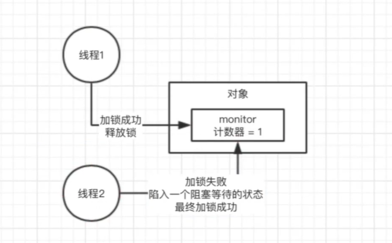
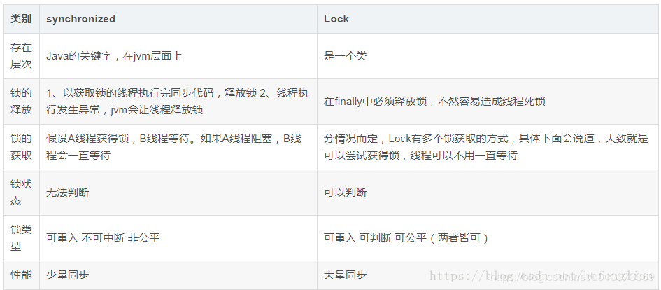

### 01. Java SE多线程基础回顾


###  02. synchronized关键字的底层原理以及跟lock锁之间的区别？

使用了synchronized关键字，在底层编译后的jvm指令中，会有monitorenter和monitorexit 两个指令。

那么monitorenter指令执行的时候会干什么呢？

每个对象都有关联的monitor，如果要对这个对象加锁，就必须获取这个对象关联的monitor的lock锁。
monitor里面的原理和思路大概是这样的，monitor里面有一个计数器，从0开始。如果一个线程要获取monitor的锁，就会判断他的计数器是不是0，如果是0，那么说明没有人获取锁，他就可以获取锁，然后对计数器加一。同理释放锁的时候就会减一。
如果一个线程来获取montior锁时发现，值不是0，这个线程就会陷入阻塞状态，就会等待计数器变成0然后执行。

注意monitor的锁是支持重复加锁的，就像下面这段代码

```java
加一次锁monitor计数器就会加一 释放一次就会减一 一直到0表示锁为可以获取的状态
synchronized(myObject){
	//一大堆代码
	synchronized(myObject){
	}
}

```



如上图，线程1来时，对象中的monitor对象为0 则可以执行，当线程2 访问时monitor为1 说明此时已有线程在使用，则加锁失败进入阻塞等待的状态，当线程1结束时monitor则变为0 此时线程2执行。

synchronized与lock的区别



###  03.聊聊你对CAS的理解以及底层实现原理？

CAS（博客地址➡）：[什么是CAS机制](https://blog.csdn.net/qq_32998153/article/details/79529704?depth_1-utm_source=distribute.pc_relevant.none-task-blog-BlogCommendFromBaidu-1&utm_source=distribute.pc_relevant.none-task-blog-BlogCommendFromBaidu-1)

下面是我对CAS的理解和总结：Compare And Swap（比较和交换）
首先说一说CAS能解决的问题。我们都知道当多个线程对同一个数据进行操作的时候，如果没有同步就会产生线程安全问题。为了解决线程线程安全问题，我们需要加上同步代码块，操作，如加上synchronized。但是某些情况下这并不是最优选择。

synchronized关键字会让没有得到锁资源的线程进入BLOCKED状态，而后在争夺到锁资源后恢复为RUNNABLE状态，这个过程中涉及到操作系统用户模式和内核模式的转换，代价比较高。这个过程是一个串行的过程，效率很低。
尽管JAVA 1.6为synchronized做了优化，增加了从偏向锁到轻量级锁再到重量级锁的过过度，但是在最终转变为重量级锁之后，性能仍然比较低。所以面对这种情况，我们就可以使用java中的“原子操作类”。

而原子操作类的底层正是用到了“CAS机制”。

CAS是英文单词Compare and Swap的缩写，翻译过来就是比较并替换。
CAS机制中使用了3个基本操作数：内存地址V，旧的预期值A，要修改的新值B。

更新一个变量的时候，只有当变量的预期值A和内存地址V当中的实际值相同时，才会将内存地址V对应的值修改为B。(具体实现详细的见上面的博客中介绍）

从思想上来说，synchronized属于悲观锁，悲观的认为程序中的并发情况严重，所以严防死守，CAS属于乐观锁，乐观地认为程序中的并发情况不那么严重，所以让线程不断去重试更新。

说了这么多，CAS是否是完美的呢，答案也是否定的。下面是说一说CAS的缺点：

1） CPU开销过大

在并发量比较高的情况下，如果许多线程反复尝试更新某一个变量，却又一直更新不成功，循环往复，会给CPU带来很到的压力。

2） 不能保证代码块的原子性

CAS机制所保证的知识一个变量的原子性操作，而不能保证整个代码块的原子性。比如需要保证3个变量共同进行原子性的更新，就不得不使用synchronized了。

3） ABA问题

这是CAS机制最大的问题所在。


###  04. ConcurrentHashMap实现线程安全的底层原理是什么？

**ConcurrentHashMap的数据结构**（数组+链表+红黑树），桶中的结构可能是链表，也可能是红黑树，红黑树是为了提高查找效率。

jdk1.7：Segment+HashEntry来进行实现的；

jdk1.8：摒弃了Segment的概念，而是直接用Node数组+链表+红黑树的数据结构来实现，并发控制使用Synchronized和CAS来操作，整个看起来就像是优化过且线程安全的 (ConcurrentHashMap的数据结构（数组+链表+红黑树），桶中的结构可能是链表，也可能是红黑树，红黑树是为了提高查找效率。)

首先聊一聊ConcurrentHashMap存在的必要性，即它能解决的问题。在编程中我们常常要对一个hashMap进行多个线程的操作，这个时候为了避免线程安全问题，我们就要给她加上同步。
但是这个时候又会有新的问题产生。

```java
我们知道hashMap的底层实现实际上是数组
多个线程过来，线程1要put的位置是数组[5]，线程二要put的位置是[21]
synchronized(map){
	map.put(xxx,xxx)
	}

```

我们可以看到向两个不同的位置添加元素，也被锁管理了，这明显是没有必要的，会造成效率低下。我们需要解决这个问题。JDK并发包里推出了ConcurrentHashMap，默认实现了线程的安全性。

下面聊一聊，它是如何实现的。

在JDK 1.7 版本，它的实现方式是分段加锁，将HashMap在底层的数组分段成几个小数组，然后给每个数组分别加锁。

JDK1.8以及之后，做了一些优化和改进，锁粒度的细化。

这里仍然是一个大的数组，数组中每个元素进行put都是有一个不同的锁，刚开始进行put的时候，如果两个线程都是在数组[5]这个位置进行put，这个时候，对数组[5]这个位置进行put的时候，采取的是CAS策略。
同一时间，只有一个线程能成功执行CAS，其他线程都会失败。
这就实现了分段加锁的第一步，如果很多个线程对数组中不同位置的元素进行操作，大家是互相不会影响的。

如果多个线程对同一个位置进行操作，CAS失败的线程，就会在这个位置基于链表+红黑树来进行处理，synchronized([5]),进行加锁。

综上所述，JDK1.8之后，只有对相同位置的元素操作，才会加锁实行串行化操作，对不同位置进行操作是并发执行的(多线程同时访问一个共享数据可以用sychronized，CAS，ConcurrentHashMap，同时也可以用Lock)


###  05. 对JDK中的AQS了解吗？AQS的实现原理是什么？


###  06.说说线程池的底层工作原理？

###  07.说说线程池的核心配置参数是干什么的？应该怎么用？

###  08.如果在线程中使用无界阻塞队列会发生什么问题？等同于问，在远服务异常的情况下，使用无界阻塞队列，是否会导致内存异常飙升？


###  09.线程池的队列满了之后，会发生什么？

###  10.如果线上机器突然宕机，线程池的阻塞队列中的请求怎么办？

###  11.谈谈对JAVA内存模型的理解？

###  12.说说JAVA内存模型中的原子性、有序性、可见性？

###  13.能从JAVA底层角度聊聊volatile关键字的原理么？

### 14你知道指令重排、内存栅栏以及happens-before这些是什么？

### 15.volatile底层是如何基于内存屏障保证可见性和有序性的？

### 16.能说说ThreadLocal的底层实现原理么？