## 1、简介

### 1.1 什么时Mybatis

- MyBatis 是一款优秀的**持久层框架**
- 它支持自定义 SQL、存储过程以及高级映射。
- MyBatis 免除了几乎所有的 JDBC 代码以及设置参数和获取结果集的工作。
- MyBatis 可以通过简单的 XML 或注解来配置和映射原始类型、接口和 Java POJO（Plain Old Java Objects，普通老式 Java 对象）为数据库中的记录。

如何获取Mybatis？

- maven仓库，需要将下面代码置于pom.xml文件中：

  ```xml
  <dependency>
    <groupId>org.mybatis</groupId>
    <artifactId>mybatis</artifactId>
    <version>x.x.x</version>
  </dependency>
  ```

### 1.2 持久化

数据持久化

- 持久化就是将程序的数据在持久状态和瞬时状态转化过程
- 内存：断电即失
- 数据库（jdbc），io文件持久化
- 生活中的持久化：冷藏、罐头

**为什么持久化？**

- 有些对象，不能丢失
- 内存珍贵，不能什么都存放在内存中

### 1.3 持久层

Dao层、Service层、Controller层...

- 完成持久化工作的代码块

### 1.4 为什么需要Mybatis？

- 帮助程序员将数据存入到数据库中
- 方便
- 传统JDBC代码复杂 -> 简化 -> 框架
- 不用Mybatis也可以，用了更容易上手。
- 优点：
  - 简单易学：没有任何第三方依赖，最简单安装只要两个jar文件+配置几个sql映射文件易于学习
  - 灵活： sql写在xml里，便于统一管理和优化。通过sql语句可以满足操作数据库的所有需求。
  - 解除sql与程序代码的耦合：通过提供DAO层，将业务逻辑和数据访问逻辑分离。sql和代码的分离，提高了可维护性。
  - 提供映射标签，支持对象与数据库的orm字段关系映射
  - 提供对象关系映射标签，支持对象关系组建维护
  - 提供xml标签，支持编写动态sql

**最重要一点：使用的人多**

## 2、第一个Mybatis程序

思路：搭建环境 --> 导入Mybatis --> 编写代码 --> 测试

### 2.1 搭建环境

搭建数据库

```mysql
create table `user`(
`id` INT(20) NOT NULL PRIMARY KEY,
`name` VARCHAR(30) DEFAULT NULL,
`pwd` VARCHAR(30) DEFAULT NULL
)ENGINE=INNODB DEFAULT CHARSET=utf8;

insert  into `user`(`id`,`name`,`pwd`) values (1,'牛二','123456'),(2,'张三','abcdef'),(3,'李四','987654');
```

新建项目

- 创建maven项目

- 删除src文件夹

- 导入maven等依赖

  ```xml
  <dependencies>
          <!--mysql驱动 -->
          <dependency>
              <groupId>mysql</groupId>
              <artifactId>mysql-connector-java</artifactId>
              <version>5.1.40</version>
          </dependency>
          <!-- mybatis-->
          <dependency>
              <groupId>org.mybatis</groupId>
              <artifactId>mybatis</artifactId>
              <version>3.5.5</version>
          </dependency>
          <!--junit-->
          <dependency>
              <groupId>junit</groupId>
              <artifactId>junit</artifactId>
              <version>4.12</version>
          </dependency>
      </dependencies>
  ```

### 2.2 创建一个模块

**配置核心文件**，在resources中创建mybatis-config.xml


```xml
<?xml version="1.0" encoding="UTF-8" ?>
<!DOCTYPE configuration
        PUBLIC "-//mybatis.org//DTD Config 3.0//EN"
        "http://mybatis.org/dtd/mybatis-3-config.dtd">
<configuration>
    <environments default="development">
        <environment id="development">
            <transactionManager type="JDBC"/>
            <dataSource type="POOLED">
                <property name="driver" value="com.mysql.jdbc.Driver"/>
                <property name="url" value="jdbc:mysql://xxx.xxx.xxx.xxx:3306/mybatis?useSSL=true&amp;useUnicode=true&amp;characterEncoding=UTF-8"/>
                <property name="username" value="root"/>
                <property name="password" value="123456"/>
            </dataSource>
        </environment>
    </environments>
    <mappers>
        <mapper resource="Mapper/UserMapper.xml"/>
    </mappers>
</configuration>
```

**编写MyBatis工具类**

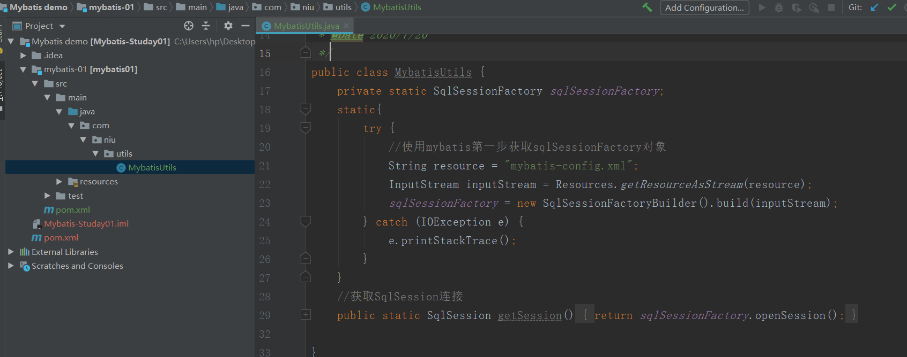

```java
public class MybatisUtils {
    private static SqlsqlSessionFactory sqlsqlSessionFactory;
    static{
        try {
            //使用mybatis第一步获取sqlsqlSessionFactory对象
            String resource = "mybatis-config.xml";
            InputStream inputStream = Resources.getResourceAsStream(resource);
            sqlsqlSessionFactory = new SqlsqlSessionFactoryBuilder().build(inputStream);
        } catch (IOException e) {
            e.printStackTrace();
        }
    }
    //获取SqlsqlSession连接
    public static SqlsqlSession getsqlSession(){
        return sqlsqlSessionFactory.opensqlSession();
    }

}
```

### 2.3 编写代码

**整体架构**

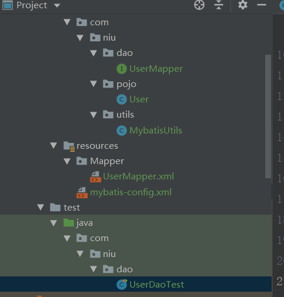

**实体类**，对应数据库字段，get/set方法，toString方法

```java
public class User {
   
   private int id;  //id
   private String name;   //姓名
   private String pwd;   //密码
   
   //构造,有参,无参
   //set/get
   //toString()
   
}
```

**编写Mapper接口类**

```java
public interface UserMapper {
    List<User> getUserList();
}
```

**编写Mapper.xml配置文件（写SQL语句）**

```xml
<?xml version="1.0" encoding="UTF-8" ?>
<!DOCTYPE mapper
        PUBLIC "-//mybatis.org//DTD Mapper 3.0//EN"
        "http://mybatis.org/dtd/mybatis-3-mapper.dtd">
<mapper namespace="com.niu.dao.UserMapper">
    <select id="getUserList" resultType="com.niu.pojo.User">
    select * from user
  </select>
</mapper>
```

- namespace  表示 绑定Dao/Mapper接口   
- id  绑定Mapper中的方法
- resultType    结果集  一个
- resultMap     结果集 多个
- parmeterType  参数类型（下面CRUD中的根据ID查找）

**编写测试方法**

```java
public class UserDaoTest {
    @Test
    public void selectUser() {
        SqlsqlSession sqlSession = MybatisUtils.getsqlSession();
        //方法一:
        //List<User> users = sqlSession.selectList("com.niu.dao.UserMapper.selectUser");
        //方法二:
        UserMapper mapper = sqlSession.getMapper(UserMapper.class);
        List<User> users = mapper.getUserList();

        for (User user: users){
            System.out.println(user);
        }
        sqlSession.close();
    }
}
```

**运行结果**

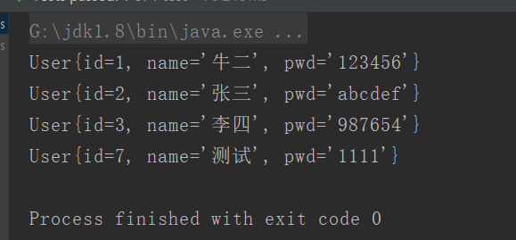

## 3、MyBatis的CRUD

### 3.1 根据id查询

**编写Mapper接口**

```java
public interface UserMapper {
    //获取全部用户
    List<User> getUserList();
    //根据id查询
    User getUserById(int id);
}
```

**编写Mapper.xml**

```xml
 <select id="getUserById" resultType="com.niu.pojo.User" parameterType="int">
  select * from user where id = #{id}
</select>
```

parameterType 为参数类型

**测试用例**

```java
@Test
public void selectUserById() {
    SqlsqlSession sqlSession = MybatisUtils.getsqlSession();
    UserMapper mapper = sqlSession.getMapper(UserMapper.class);
    User user = mapper.getUserById(1);
        System.out.println(user);
    sqlSession.close();
}
```

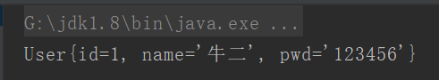

### 3.2 增加

****

**编写Mapper接口**

```java
//增加
int addUser(User user);
```

**编写Mapper.xml**

```xml
<insert id="addUser" parameterType="com.niu.pojo.User">
    insert into user (id,name,pwd) values (#{id},#{name},#{pwd})
</insert>
```

**测试用例**

```java
//增删改需要提交事务
@Test
public void addUser() {
    SqlsqlSession sqlsqlSession = MybatisUtils.getsqlSession();
    UserMapper mapper = sqlsqlSession.getMapper(UserMapper.class);
    mapper.addUser(new User(4,"ggg","111"));
    sqlsqlSession.commit();
    sqlsqlSession.close();
}
```

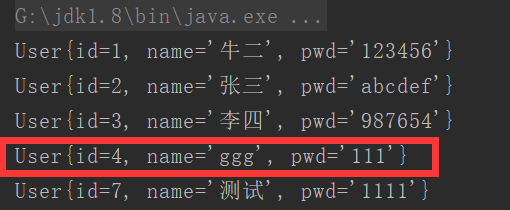

### 3.3 修改

**编写Mapper接口**

```java
//修改
int updateUser(User user);
```

**编写Mapper.xml**

```xml
<update id="updateUser" parameterType="com.niu.pojo.User">
    update user set name = #{name},pwd = #{pwd} where id= #{id};
</update>
```

**测试用例**

```java
//增删改需要提交事务
@Test
public void updateUser() {
    SqlSession sqlSession = MybatisUtils.getSession();
    UserMapper mapper = sqlSession.getMapper(UserMapper.class);
    mapper.updateUser(new User(4,"gg","1112"));
    sqlSession.commit();
    sqlSession.close();
}
```

### 3.4 删除

**编写Mapper接口**

```java
//删除
int deleteById(int id);
```

**编写Mapper.xml**

```xml
<delete id="deleteById" parameterType="int">
    delete from user where id = #{id}
</delete>
```

**测试用例**

```java
//增删改需要提交事务
@Test
public void deleteById() {
    SqlSession sqlSession = MybatisUtils.getSession();
    UserMapper mapper = sqlSession.getMapper(UserMapper.class);
    mapper.deleteById(4);
    sqlSession.commit();
    sqlSession.close();
}
```

### 3.5 模糊查询

第一种：在Java代码中添加sql通配符

```java
string wildcardname = “%smi%”;
list<name> names = mapper.selectlike(wildcardname);

<select id=”selectlike”>
select * from foo where bar like #{value}
</select>
```

第二种：在sql语句中拼接通配符，会引起sql注入

```xml
string wildcardname = “smi”;
list<name> names = mapper.selectlike(wildcardname);

<select id=”selectlike”>
    select * from foo where bar like "%"#{value}"%"
</select>
```

## 4、配置解析

4.1

MyBatis 的配置文件包含了会深深影响 MyBatis 行为的设置和属性信息。 配置文档的顶层结构如下：

- configuration（配置）
  - [properties（属性）](https://mybatis.org/mybatis-3/zh/configuration.html#properties)
  - [settings（设置）](https://mybatis.org/mybatis-3/zh/configuration.html#settings)
  - [typeAliases（类型别名）](https://mybatis.org/mybatis-3/zh/configuration.html#typeAliases)
  - [typeHandlers（类型处理器）](https://mybatis.org/mybatis-3/zh/configuration.html#typeHandlers)
  - [objectFactory（对象工厂）](https://mybatis.org/mybatis-3/zh/configuration.html#objectFactory)
  - [plugins（插件）](https://mybatis.org/mybatis-3/zh/configuration.html#plugins)
  - environments（环境配置）
    - environment（环境变量）
      - transactionManager（事务管理器）
      - dataSource（数据源）
  - [databaseIdProvider（数据库厂商标识）](https://mybatis.org/mybatis-3/zh/configuration.html#databaseIdProvider)
  - [mappers（映射器）](https://mybatis.org/mybatis-3/zh/configuration.html#mappers)

### 4.2 environment（环境变量）

MyBatis 可以配置成适应多种环境，这种机制有助于将 SQL 映射应用于多种数据库之中， 现实情况下有多种理由需要这么做。例如，开发、测试和生产环境需要有不同的配置；或者想在具有相同 Schema 的多个生产数据库中使用相同的 SQL 映射。还有许多类似的使用场景。

**不过要记住：尽管可以配置多个环境，但每个 SqlSessionFactory 实例只能选择一种环境。**

mybatis默认事务管理器 JDBC  连接池：POOLED

### 4.3 properties（属性）

可以通过properties属性来实现引用配置文件

这些属性可以在外部进行配置，并可以进行动态替换。你既可以在典型的 Java 属性文件中配置这些属性，也可以在 properties 元素的子元素中设置。

**编写配置文件db.properties**

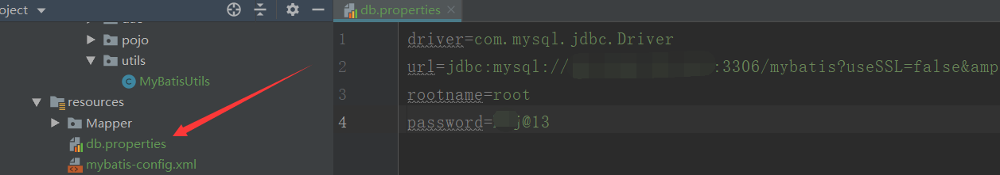

**引入配置文件**

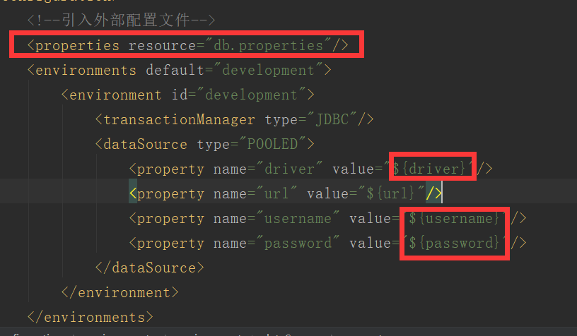

### 4.4 settings(设置)

**类型别名**

```xml
<typeAliases>
  <typeAlias alias="user" type="com.niu.pojo.User"/>
</typeAliases>
不写别名：
 <select id="getUserList" resultType="com.niu.pojo.User">
    select * from user
  </select>
写了：
resultType="user"
```

**也可以指定一个包名**，MyBatis 会在包名下面搜索需要的 Java Bean，比如:

```xml
<typeAliases>
  <package name="com.niu.pojo"/>
</typeAliases>
```

pojo下的每个实体类，在没有注解的情况下，会使用 Bean 的首字母小写的非限定类名来作为它的别名。若有注解，则别名为其注解值。

```java
@Alias("author")
public class Author {
    ...
}
```

**开启缓存与懒加载**

| cacheEnabled       | 全局性地开启或关闭所有映射器配置文件中已配置的任何缓存。     | true \|false  | true  |
| ------------------ | ------------------------------------------------------------ | ------------- | ----- |
| lazyLoadingEnabled | 延迟加载的全局开关。当开启时，所有关联对象都会延迟加载。 特定关联关系中可通过设置 `fetchType` 属性来覆盖该项的开关状态。 | true \| false | false |

### 4.5 生命周期和作用域

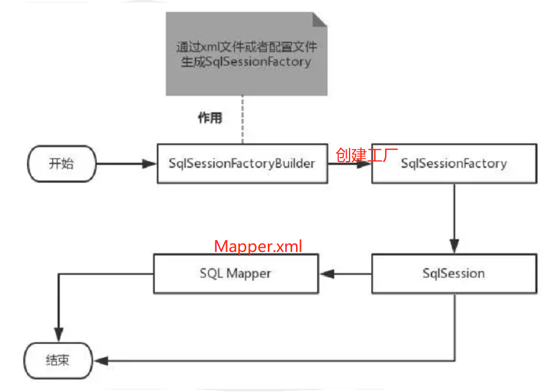

生命周期，和作用域，是至关重要的，因为错误的使用会导致非常严重的**并发问题**。

**SqlSessionFactoryBuilder** 

- 作用在于创建 SqlSessionFactory，创建成功后，就失去了作用
- **SqlSessionFactoryBuilder 实例的最佳作用域是方法作用域**（也就是局部方法变量）

**SqlSessionFactory **

- 可以被认为是一个数据库连接池，它的作用是创建 SqlSession 接口对象
- 一旦被创建就应该在应用的运行期间一直存在，没有任何理由丢弃它或重新创建另一个实例。
- 最佳作用域是应用作用域
- 最简单的就是使用单例模式或者静态单例模式

**SqlSession**

- 可以比作连接池里面的一个连接
- 作用域是请求或方法作用域
- 用完之后关闭，否者资源被占用


## 5、解决属性名和字段名不一致的问题（resultMap）

**实体类修改**

```java
public class User {
    private int id;
    private String name;
    private String password;
    ....
}
```

测试结果：

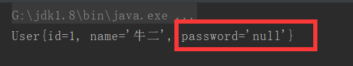

解决办法：

- 起别名：select id,name,pwd ad password from user where id = #{id}

- resultMap 结果集映射

  ```xml
    <select id="getUserById" resultMap="UserMap">
    select * from user where id = #{id}
  </select>
    <!--id对象上方resultMap的内容， type为映射的结果集-->
    <resultMap id="UserMap" type="com.niu.pojo.User">
        <!--column数据库中的字段，property实体类中的属性-->
        <result column="id" property="id"/>
        <result column="name" property="name"/>
        <result column="pwd" property="password"/>
    </resultMap>
  ```

## 6、日志

### 6.1 日志工厂

在db.properties中配置

```xml
<?xml version="1.0" encoding="UTF-8" ?>
<!DOCTYPE configuration
        PUBLIC "-//mybatis.org//DTD Config 3.0//EN"
        "http://mybatis.org/dtd/mybatis-3-config.dtd">
<configuration>
    <!--引入外部配置文件-->
    <properties resource="db.properties"/>
    <!--日志-->
    <settings>
        <setting name="logImpl" value="STDOUT_LOGGING"/>
    </settings>
    <!--可以给实体类起别名，方便resultType-->
    <typeAliases>
        <package name="com.niu.pojo"/>
    </typeAliases>
    <environments default="development">
        <environment id="development">
            <transactionManager type="JDBC"/>
            <dataSource type="POOLED">
                <property name="driver" value="${driver}"/>
                <property name="url" value="${url}"/>
                <property name="username" value="${username}"/>
                <property name="password" value="${password}"/>
            </dataSource>
        </environment>
    </environments>
    <mappers>
        <mapper resource="Mapper/UserMapper.xml"/>
    </mappers>
</configuration>
```

### 6.2 Log4j

**导入log4j依赖**

```xml
<dependency>
<groupId>log4j</groupId>
<artifactId>log4j</artifactId>
<version>1.2.17</version>
</dependency>
```

**创建log4j.properties**

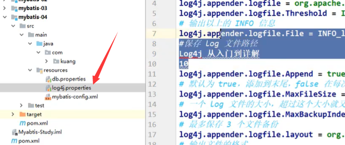

**然后百度人家写好的配置文件 复制即可**

**最后在db.properties的settings日志配置修改**

```xml
<settings>
        <setting name="logImpl" value="Log4j"/>
    </settings>
```

**Log4j使用**

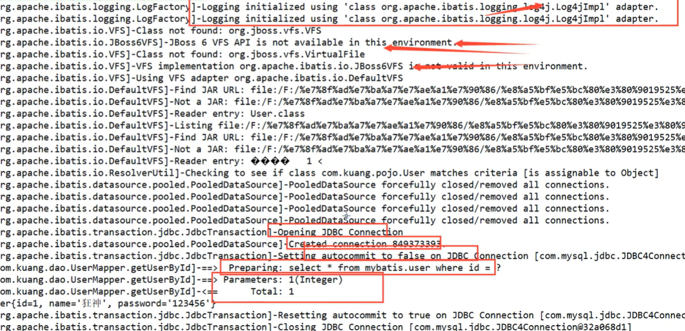

## 7、分页

**为什么分页？**减少数据处理量

### 7.1 Limit分页

```java
语法：SELECT * FROM user LIMIT startIndex，pageSize;
实例：SELECT * FROM user LIMIT 2;  #[0，n]
```

使用Mybatis实现分页，核心SQL

1、接口

```java
//分页
List<User> getUserByLimit(Map<String,Integer> map);
```

2、Mapper.xml

```xml
<select id="getUserByLimit" resultType="User" parameterType="map">
    select * from  user  limit #{startIndex},#{pageSize}
</select>
```

3、测试

```java
@Test
public void getUserByLimit(){
    SqlSession sqlSession =  MyBatisUtils.getSession();
    UserMapper mapper = sqlSession.getMapper(UserMapper.class);
    HashMap<String, Integer> map = new HashMap<>();
    map.put("startIndex",0);
    map.put("pageSize",2);
    mapper.getUserByLimit(map);
}
```

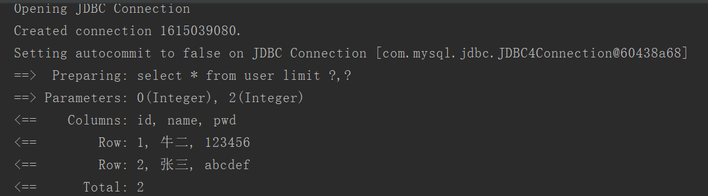

### 7.2 RowBounds分页

1、接口

```java
//RowBounds分页
List<User> getUserByRowBounds();
```

2、mapper.xml

```xml
<select id="getUserByRowBounds" resultType="User">
    select * from user
</select>
```

3、测试

```java
@Test
public void getUserByRowBounds(){
    SqlSession sqlsession = MyBatisUtils.getSession();
    //RowBounds实现
    RowBounds rowBounds = new RowBounds(1, 3);
    //通过Java代码层实现分页
    List<User> userList = sqlsession.selectList("com.niu.dao.UserMapper.getUserByRowBounds",null,rowBounds);
    for (User u :
            userList) {
        System.out.println(u);

    }
}
```

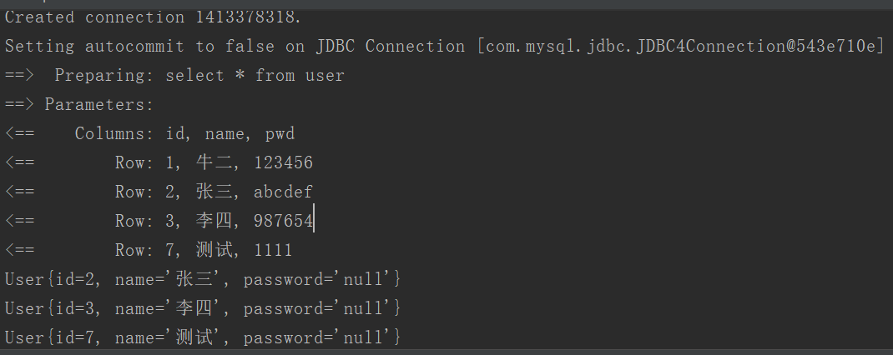

### 7.3 分页插件-PageHelper

https://pagehelper.github.io/docs/howtouse/

## 8、使用注解开发

### 8.1 面向接口编程

根本原因： 解耦

### 8.2 使用注解开发

1.注解在接口上实现

```java
@Select("select * from user")
List<User> getUsers();
```

2.核心mybatis配置文件中绑定接口

```xml
<?xml version="1.0" encoding="UTF-8" ?>
<!DOCTYPE configuration
        PUBLIC "-//mybatis.org//DTD Config 3.0//EN"
        "http://mybatis.org/dtd/mybatis-3-config.dtd">
<configuration>
    <!--引入外部配置文件-->
    <properties resource="db.properties"/>
    <!--日志-->
    <settings>
        <setting name="logImpl" value="STDOUT_LOGGING"/>
    </settings>
    <!--可以给实体类起别名，方便resultType-->
    <typeAliases>
        <package name="com.niu.pojo"/>
    </typeAliases>
    <environments default="development">
        <environment id="development">
            <transactionManager type="JDBC"/>
            <dataSource type="POOLED">
                <property name="driver" value="${driver}"/>
                <property name="url" value="${url}"/>
                <property name="username" value="${username}"/>
                <property name="password" value="${password}"/>
            </dataSource>
        </environment>
    </environments>
    <!--绑定接口-->
    <mappers>
        <mapper class="com.niu.dao.UserMapper"></mapper>
    </mappers>
</configuration>
```

3.测试使用

```java
@Test
public void test(){
    SqlSession sqlSession = MyBatisUtils.getSession();
    //底层主要应用反射
    UserMapper mapper = sqlSession.getMapper(UserMapper.class);
    List<User> users = mapper.getUsers();
    for (User user: users
         ) {
        System.out.println(user);
    }
    sqlSession.close();
}
```

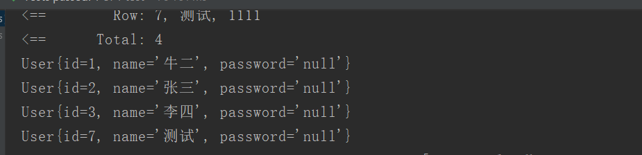

本质：反射机制实现

底层：动态代理

### 8.3 mybatis执行流程


### 8.4 注解CRUD

工具类实现自动提交（查看不用事务提交，但增删改需要）

```Java
public class MyBatisUtils {
    private static SqlSessionFactory sqlSessionFactory;
    static{
        try {
            //使用mybatis第一步获取sqlSessionFactory对象
            String resource = "mybatis-config.xml";
            InputStream inputStream = Resources.getResourceAsStream(resource);
            sqlSessionFactory = new SqlSessionFactoryBuilder().build(inputStream);
        } catch (IOException e) {
            e.printStackTrace();
        }
    }
    //获取SqlSession连接 并实现自动提交事务
    public static SqlSession getSession(){
        return sqlSessionFactory.openSession();
    }
}
```

编写Mapper接口

```java
public interface UserMapper {
    //查询
    @Select("select * from user")
   List<User> getUsers();

    //方法存在多个参数时使用@Param 且以此注解为主
    @Select("select *  from user where id = #{id}")
    User getUserById(@Param("id") int id);
    @Insert("insert into user (id,name,pwd) values (#{id},#{name},#{password})")
    int addUser(User user);
    @Update("update user set name=#{name},pwd=#{password} where id = #{id}")
    int UpdateUser(User user);
    @Delete("delete from user where id = #{id}")
    int deleteUser(@Param("id") int id);
}
```

测试类

```java
public class UserMapperTest {
    @Test
    public void test(){
        SqlSession sqlSession = MyBatisUtils.getSession();
        //底层主要应用反射
        UserMapper mapper = sqlSession.getMapper(UserMapper.class);
        //查询
        List<User> users = mapper.getUsers();
        for (User user: users
             ) {
            System.out.println(user);
        }
        //按照id查询
        User user = mapper.getUserById(1);
        System.out.println(user);
        //新增
        mapper.addUser(new User(5,"niuniu","qwe"));
        //修改
        mapper.UpdateUser(new User(5,"ntj","ewq"));
        //删除
         mapper.deleteUser(7);
        sqlSession.close();
    }
}
```

注意要在mybatis中绑定接口

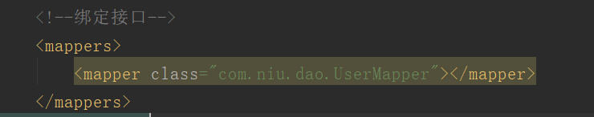

XML绑定xml文件

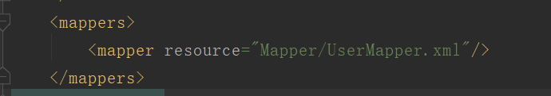

## 9、Lombok

插件 简便编程 不用写get/set方法

## 10、多对一处理

多对一的理解：

- 多个学生对应一个老师
- 如果对于学生这边，就是一个多对一的现象，即从学生这边关联一个老师！

1.数据库设计

```mysql
CREATE TABLE `teacher` (
`id` INT(10) NOT NULL,
`name` VARCHAR(30) DEFAULT NULL,
PRIMARY KEY (`id`)
) ENGINE=INNODB DEFAULT CHARSET=utf8

INSERT INTO teacher(`id`, `name`) VALUES (1, '秦老师');

CREATE TABLE `student` (
`id` INT(10) NOT NULL,
`name` VARCHAR(30) DEFAULT NULL,
`tid` INT(10) DEFAULT NULL,
PRIMARY KEY (`id`),
KEY `fktid` (`tid`),
CONSTRAINT `fktid` FOREIGN KEY (`tid`) REFERENCES `teacher` (`id`)
) ENGINE=INNODB DEFAULT CHARSET=utf8


INSERT INTO `student` (`id`, `name`, `tid`) VALUES ('1', '小明', '1');
INSERT INTO `student` (`id`, `name`, `tid`) VALUES ('2', '小红', '1');
INSERT INTO `student` (`id`, `name`, `tid`) VALUES ('3', '小张', '1');
INSERT INTO `student` (`id`, `name`, `tid`) VALUES ('4', '小李', '1');
INSERT INTO `student` (`id`, `name`, `tid`) VALUES ('5', '小王', '1');
```

2.创建实体类Techer、Student

3.创建两个Mapper接口

4.创建Mapper.xml

两种方法 通常推荐结果嵌套处理

```xml
<?xml version="1.0" encoding="UTF-8" ?>
<!DOCTYPE mapper
        PUBLIC "-//mybatis.org//DTD Mapper 3.0//EN"
        "http://mybatis.org/dtd/mybatis-3-mapper.dtd">
<mapper namespace="com.niu.dao.StudentMapper">

    <!--方法一  按查询结果嵌套处理
思路：
   1. 直接查询出结果，进行结果集的映射
-->
    <select id="getStudent2" resultMap="StudentTeacher2" >
  select
      s.id sid,
      s.name sname,
      t.name tname
  from
      student s,teacher t
  where
      s.tid = t.id
</select>

    <resultMap id="StudentTeacher2" type="Student">
         <!--column数据库中的字段，property实体类中的属性-->
        <id property="id" column="sid"/>
        <result property="name" column="sname"/>
        <!--关联对象property 关联对象在Student实体类中的属性-->
        <association property="teacher" javaType="Teacher">
            <result property="name" column="tname"/>
        </association>
    </resultMap>
    
    <!--方法二  子查询
    1.查询所有学生信息
    2.根据查询出的学生的tid，寻找对应的老师 
    -->
    <select id="getStudent" resultMap="StudentExtend">
        select * from student
    </select>
    <resultMap id="StudentExtend" type="Student">
        <result property="id" column="id"/>
        <result property="name" column="name"/>
       <!--复杂的属性单独处理
       对象使用 : association
       集合     : collection
       -->
        <association property="teacher" column="tid" javaType="Teacher" select="getTeacher"/>
    </resultMap>
    <select id="getTeacher" resultType="Teacher">
        select * from teacher where id = #{id}
    </select>
</mapper>
```

5.在配置文件中注册绑定Mapper接口

6.测试

## 11、一对多处理

一对多的理解：

- 一个老师拥有多个学生
- 如果对于老师这边，就是一个一对多的现象，即从一个老师下面拥有一群学生（集合）！

与多对一大致相同

```xml
<?xml version="1.0" encoding="UTF-8" ?>
<!DOCTYPE mapper
        PUBLIC "-//mybatis.org//DTD Mapper 3.0//EN"
        "http://mybatis.org/dtd/mybatis-3-mapper.dtd">
<mapper namespace="com.niu.dao.TeacherMapper">

    <!--结果嵌套法
  思路:
      1. 从学生表和老师表中查出学生id，学生姓名，老师姓名
      2. 对查询出来的操作做结果集映射
          1. 集合的话，使用collection！
              JavaType和ofType都是用来指定对象类型的
              JavaType是用来指定pojo中属性的类型
              ofType指定的是映射到list集合属性中pojo的类型。
  -->
    <select id="getTeacher" resultMap="TeacherExtend">
      select s.id sid, s.name sname , t.name tname, t.id tid
      from student s,teacher t
      where s.tid = t.id and t.id=#{tid}
    </select>
    <resultMap id="TeacherExtend" type="Teacher">
        <result property="id" column="tid"/>
        <result property="name" column="tname"/>
        <collection property="student" ofType="Student">
            <result property="id" column="sid"/>
            <result property="name" column="sname"/>
            <result property="tid" column="tid"/>
        </collection>
    </resultMap>
    
   <!--子查询法-->
    <select id="getTeacher2" resultMap="TeacherStudent2">
select * from teacher where id = #{tid}
</select>
    <resultMap id="TeacherStudent2" type="Teacher">
        <!--column是一对多的外键 , 写的是一的主键的列名-->
        <collection property="student" javaType="ArrayList" ofType="Student" column="id" select="getStudentByTeacherId"/>
    </resultMap>
    <select id="getStudentByTeacherId" resultType="Student">
  select * from student where tid = #{id}
</select>
</mapper>
```

1、关联-association【多对一】

2、集合-collection   【一对多】

3、所以association是用于一对一和多对一，而collection是用于一对多的关系

4、JavaType和ofType都是用来指定对象类型的

- JavaType是用来指定pojo中属性的类型
- ofType指定的是映射到list集合属性中pojo的类型。

## 12、动态SQL

动态SQL：动态SQL就是指根据不同条件生成不同的SQL语句

### 12.1 搭建环境

数据库

```mysql
CREATE TABLE `blog` (
`id` varchar(50) NOT NULL COMMENT '博客id',
`title` varchar(100) NOT NULL COMMENT '博客标题',
`author` varchar(30) NOT NULL COMMENT '博客作者',
`create_time` datetime NOT NULL COMMENT '创建时间',
`views` int(30) NOT NULL COMMENT '浏览量'
) ENGINE=InnoDB DEFAULT CHARSET=utf8
```

创建IDutils类，随机生成id

```java
public class IDUtil {

   public static String genId(){
       return UUID.randomUUID().toString().replaceAll("-","");
  }
}
```

创建实体类

```java
public class Blog {
   private String id;
   private String title;
   private String author;
   private Date createTime;
   private int views;
   //set，get....
}
```

创建Mapper接口

创建Mapper.XML

```xml
<?xml version="1.0" encoding="UTF-8" ?>
<!DOCTYPE mapper
       PUBLIC "-//mybatis.org//DTD Mapper 3.0//EN"
       "http://mybatis.org/dtd/mybatis-3-mapper.dtd">
<mapper namespace="com.niu.dao.BlogMapper">

</mapper>
```

mybatis核心配置文件，下划线驼峰自动转换

```xml
<settings>
   <setting name="mapUnderscoreToCamelCase" value="true"/>
   <setting name="logImpl" value="STDOUT_LOGGING"/>
</settings>
<!--注册Mapper.xml-->
<mappers>
 <mapper resource="Mapper/BlogMapper.xml"/>
</mappers>
```

插入初始数据

```java
int addBlog(Blog blog);
```

sql配置文件

编写接口

```xml
<insert id="addBlog" parameterType="blog">
  insert into blog (id, title, author, create_time, views)
  values (#{id},#{title},#{author},#{createTime},#{views});
</insert>
```

添加数据

```java
@Test
public void addInitBlog(){
    SqlSession session = MyBatisUtils.getSession();
    BlogMapper mapper = session.getMapper(BlogMapper.class);

    Blog blog = new Blog();
    blog.setId(IDUtils.getId());
    blog.setTitle("Mybatis如此简单");
    blog.setAuthor("牛一");
    blog.setCreateTime(new Date());
    blog.setViews(9999);

    mapper.addBlog(blog);

    blog.setId(IDUtils.getId());
    blog.setTitle("Java如此简单");
    blog.setAuthor("牛二");
    mapper.addBlog(blog);

    blog.setId(IDUtils.getId());
    blog.setTitle("Spring如此简单");
    mapper.addBlog(blog);

    blog.setId(IDUtils.getId());
    blog.setTitle("微服务如此简单");
    blog.setAuthor("牛三");
    mapper.addBlog(blog);

    session.close();
}
```

### 12.2 If标签

1、编写接口类

```java
//需求1
List<Blog> queryBlogIf(Map map);
```

2、编写SQL语句

```xml
<!--需求1：
根据作者名字和博客名字来查询博客！
如果作者名字为空，那么只根据博客名字查询，反之，则根据作者名来查询
select * from blog where title = #{title} and author = #{author}
-->
<select id="queryBlogIf" parameterType="map" resultType="blog">
  select * from blog where
   <if test="title != null">
      title = #{title}
   </if>
   <if test="author != null">
      and author = #{author}
   </if>
</select>
```

3、测试

```java
@Test
public void testQueryBlogIf(){
   SqlSession session = MybatisUtils.getSession();
   BlogMapper mapper = session.getMapper(BlogMapper.class);

   HashMap<String, String> map = new HashMap<String, String>();
   map.put("title","Mybatis如此简单");
   map.put("author","牛一java");
   List<Blog> blogs = mapper.queryBlogIf(map);

   System.out.println(blogs);

   session.close();
}
```

这样写我们可以看到，如果 author 等于 null，那么查询语句为 select * from user where title=#{title},但是如果title为空呢？那么查询语句为 select * from user where and author=#{author}，这是错误的 SQL 语句，如何解决呢？请看下面的 where 语句！

### 12.2 where标签

```xml
<select id="queryBlogIf" parameterType="map" resultType="blog">
  select * from blog
   <where>
       <if test="title != null">
          title = #{title}
       </if>
       <if test="author != null">
          and author = #{author}
       </if>
   </where>
</select>
```

### 12.3 set标签（更新）

1、编写接口方法

```java
int updateBlog(Map map);
```

2、sql配置文件

```xml
<!--注意set是用的逗号隔开-->
<update id="updateBlog" parameterType="map">
  update blog
     <set>
         <if test="title != null">
            title = #{title},
         </if>
         <if test="author != null">
            author = #{author}
         </if>
     </set>
  where id = #{id};
</update>
```

3、测试

```java
@Test
public void testUpdateBlog(){
   SqlSession session = MybatisUtils.getSession();
   BlogMapper mapper = session.getMapper(BlogMapper.class);

   HashMap<String, String> map = new HashMap<String, String>();
   map.put("title","动态SQL");
   map.put("author","测试");
   map.put("id","9d6a763f5e1347cebda43e2a32687a77");

   mapper.updateBlog(map);


   session.close();
}
```

### 12.4 choose、when、otherwise

有时候，我们不想使用所有的条件，而只是想从多个条件中选择一个使用。针对这种情况，MyBatis 提供了 choose 元素，它有点像 Java 中的 switch 语句。

还是上面的例子，但是策略变为：传入了 “title” 就按 “title” 查找，传入了 “author” 就按 “author” 查找的情形。若两者都没有传入，就返回标记为 featured 的 BLOG（这可能是管理员认为，与其返回大量的无意义随机 Blog，还不如返回一些由管理员挑选的 Blog）。

```xml
<select id="findActiveBlogLike"
     resultType="Blog">
  SELECT * FROM BLOG WHERE state = ‘ACTIVE’
  <choose>
    <when test="title != null">
      AND title like #{title}
    </when>
    <when test="author != null and author.name != null">
      AND author_name like #{author.name}
    </when>
    <otherwise>
      AND views = #{views}
    </otherwise>
  </choose>
</select>
```

## 13、缓存（了解）

### 13.1 简介

1、什么是缓存 [ Cache ]？

- 存在内存中的临时数据。
- 将用户经常查询的数据放在缓存（内存）中，用户去查询数据就不用从磁盘上(关系型数据库数据文件)查询，从缓存中查询，从而提高查询效率，解决了高并发系统的性能问题。

2、为什么使用缓存？

- 减少和数据库的交互次数，减少系统开销，提高系统效率。

3、什么样的数据能使用缓存？

- 经常查询并且不经常改变的数据。

### 13.2 Mybatis缓存

- MyBatis包含一个非常强大的查询缓存特性，它可以非常方便地定制和配置缓存。缓存可以极大的提升查询效率。

- MyBatis系统中默认定义了两级缓存：**一级缓存**和**二级缓存**

- - 默认情况下，只有一级缓存开启。（SqlSession级别的缓存，也称为本地缓存）
  - 二级缓存需要手动开启和配置，他是基于namespace级别的缓存。
  - 为了提高扩展性，MyBatis定义了缓存接口Cache。我们可以通过实现Cache接口来自定义二级缓存


### 13.3 一级缓存

一级缓存也叫本地缓存：

- 与数据库同一次会话期间查询到的数据会放在本地缓存中。
- 以后如果需要获取相同的数据，直接从缓存中拿，没必须再去查询数据库；

```java
 @Test
    public void test(){
        SqlSession sqlSession = MyBatisUtils.getSession();
        UserMapper mapper = sqlSession.getMapper(UserMapper.class);
        User u1 = mapper.queryUserById(1);
        System.out.println(u1);
        System.out.println("=========================");
        User u2 = mapper.queryUserById(1);
        System.out.println(u2);
        System.out.println(u1==u2);
        sqlSession.close();
    }
```

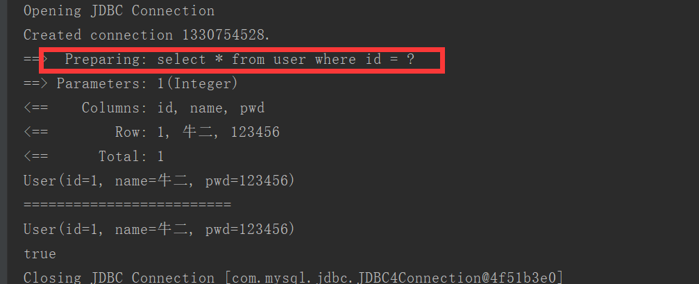

小结：一级缓存默认是开启的，只在一次SqlSession中有效，也就是拿到连接到关闭这个区间段。

一级缓存的四种失效情况：

- sqlSession不同
- 增删改操作，可能会改变原来的数据，所以必定会刷新缓存
- 查询不同的Mapper.xml
- 手动清理缓存 ->  session.clearCache();

### 13.4 二级缓存（全局缓存）

- 二级缓存也叫全局缓存，一级缓存作用域太低了，所以诞生了二级缓存

- 基于namespace级别的缓存，一个名称空间，对应一个二级缓存；

- 工作机制

- - 一个会话查询一条数据，这个数据就会被放在当前会话的一级缓存中；
  - 如果当前会话关闭了，这个会话对应的一级缓存就没了；但是我们想要的是，会话关闭了，一级缓存中的数据被保存到二级缓存中；
  - 新的会话查询信息，就可以从二级缓存中获取内容；
  - 不同的mapper查出的数据会放在自己对应的缓存（map）中；


> 使用步骤

1、开启全局缓存 【mybatis-config.xml】

```
<setting name="cacheEnabled" value="true"/>
```

2、去每个mapper.xml中配置使用二级缓存，这个配置非常简单；【xxxMapper.xml】

```xml
直接开启
<cache/>
官方示例（带参开启）
<cache
 eviction="FIFO"
 flushInterval="60000"
 size="512"
 readOnly="true"/>
这个更高级的配置创建了一个 FIFO 缓存，每隔 60 秒刷新，最多可以存储结果对象或列表的 512 个引用，而且返回的对象被认为是只读的，因此对它们进行修改可能会在不同线程中的调用者产生冲突。
```

3、代码测试

- 所有的实体类先实现序列化接口
- 测试代码

```java
@Test
public void testQueryUserById(){
   SqlSession session = MybatisUtils.getSession();
   SqlSession session2 = MybatisUtils.getSession();

   UserMapper mapper = session.getMapper(UserMapper.class);
   UserMapper mapper2 = session2.getMapper(UserMapper.class);

   User user = mapper.queryUserById(1);
   System.out.println(user);
   session.close();
   System.out.println("=======");
   User user2 = mapper2.queryUserById(1);
   System.out.println(user2);
   System.out.println(user==user2);

   session2.close();
}
```


> 结论

- 只要开启了二级缓存，我们在同一个Mapper中的查询，可以在二级缓存中拿到数据
- 查出的数据都会被默认先放在一级缓存中
- 只有会话提交或者关闭以后，一级缓存中的数据才会转到二级缓存中

### 13.5 缓存原理


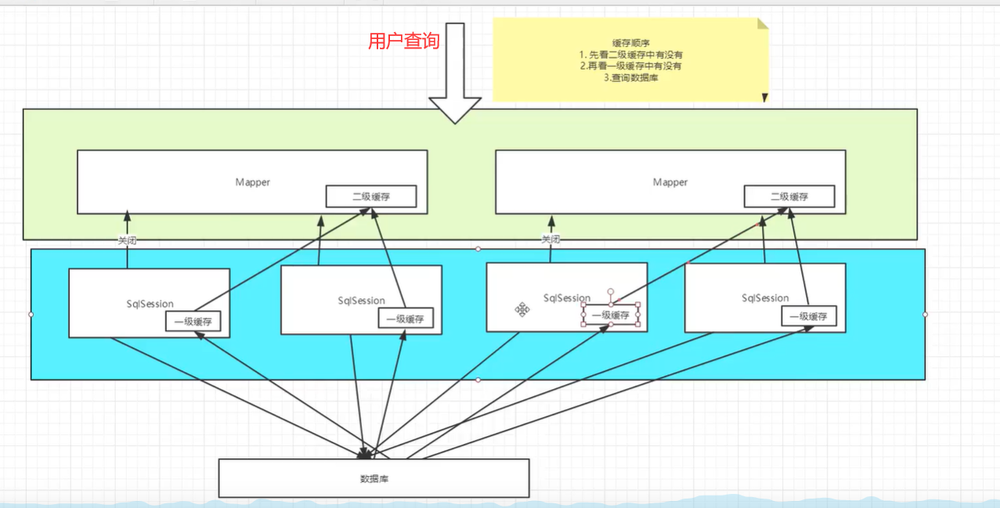

### 13.6 自定义缓存EhCache

```xml
<dependency>
   <groupId>org.mybatis.caches</groupId>
   <artifactId>mybatis-ehcache</artifactId>
   <version>1.1.0</version>
</dependency>
```

在mapper.xml中使用对应的缓存即可

```
<mapper namespace = “org.acme.FooMapper” > 
   <cache type = “org.mybatis.caches.ehcache.EhcacheCache” /> 
</mapper>
```

编写ehcache.xml文件，如果在加载时未找到/ehcache.xml资源或出现问题，则将使用默认配置。

```xml
<?xml version="1.0" encoding="UTF-8"?>
<ehcache xmlns:xsi="http://www.w3.org/2001/XMLSchema-instance"
        xsi:noNamespaceSchemaLocation="http://ehcache.org/ehcache.xsd"
        updateCheck="false">
   <!--
      diskStore：为缓存路径，ehcache分为内存和磁盘两级，此属性定义磁盘的缓存位置。参数解释如下：
      user.home – 用户主目录
      user.dir – 用户当前工作目录
      java.io.tmpdir – 默认临时文件路径
    -->
   <diskStore path="./tmpdir/Tmp_EhCache"/>
   
   <defaultCache
           eternal="false"
           maxElementsInMemory="10000"
           overflowToDisk="false"
           diskPersistent="false"
           timeToIdleSeconds="1800"
           timeToLiveSeconds="259200"
           memoryStoreEvictionPolicy="LRU"/>

   <cache
           name="cloud_user"
           eternal="false"
           maxElementsInMemory="5000"
           overflowToDisk="false"
           diskPersistent="false"
           timeToIdleSeconds="1800"
           timeToLiveSeconds="1800"
           memoryStoreEvictionPolicy="LRU"/>
   <!--
      defaultCache：默认缓存策略，当ehcache找不到定义的缓存时，则使用这个缓存策略。只能定义一个。
    -->
   <!--
     name:缓存名称。
     maxElementsInMemory:缓存最大数目
     maxElementsOnDisk：硬盘最大缓存个数。
     eternal:对象是否永久有效，一但设置了，timeout将不起作用。
     overflowToDisk:是否保存到磁盘，当系统当机时
     timeToIdleSeconds:设置对象在失效前的允许闲置时间（单位：秒）。仅当eternal=false对象不是永久有效时使用，可选属性，默认值是0，也就是可闲置时间无穷大。
     timeToLiveSeconds:设置对象在失效前允许存活时间（单位：秒）。最大时间介于创建时间和失效时间之间。仅当eternal=false对象不是永久有效时使用，默认是0.，也就是对象存活时间无穷大。
     diskPersistent：是否缓存虚拟机重启期数据 Whether the disk store persists between restarts of the Virtual Machine. The default value is false.
     diskSpoolBufferSizeMB：这个参数设置DiskStore（磁盘缓存）的缓存区大小。默认是30MB。每个Cache都应该有自己的一个缓冲区。
     diskExpiryThreadIntervalSeconds：磁盘失效线程运行时间间隔，默认是120秒。
     memoryStoreEvictionPolicy：当达到maxElementsInMemory限制时，Ehcache将会根据指定的策略去清理内存。默认策略是LRU（最近最少使用）。你可以设置为FIFO（先进先出）或是LFU（较少使用）。
     clearOnFlush：内存数量最大时是否清除。
     memoryStoreEvictionPolicy:可选策略有：LRU（最近最少使用，默认策略）、FIFO（先进先出）、LFU（最少访问次数）。
     FIFO，first in first out，这个是大家最熟的，先进先出。
     LFU， Less Frequently Used，就是上面例子中使用的策略，直白一点就是讲一直以来最少被使用的。如上面所讲，缓存的元素有一个hit属性，hit值最小的将会被清出缓存。
     LRU，Least Recently Used，最近最少使用的，缓存的元素有一个时间戳，当缓存容量满了，而又需要腾出地方来缓存新的元素的时候，那么现有缓存元素中时间戳离当前时间最远的元素将被清出缓存。
  -->

</ehcache>
```

