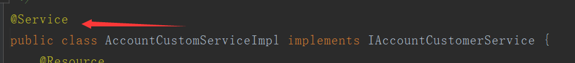
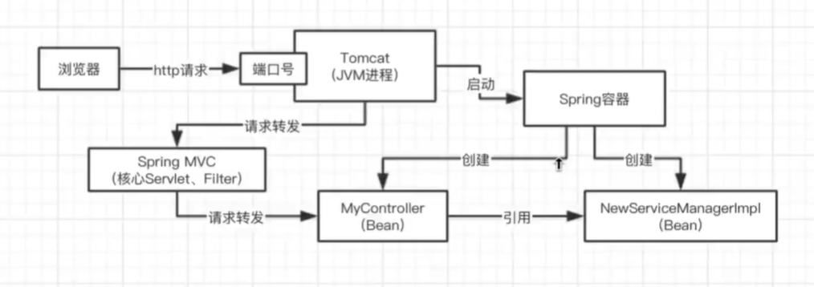
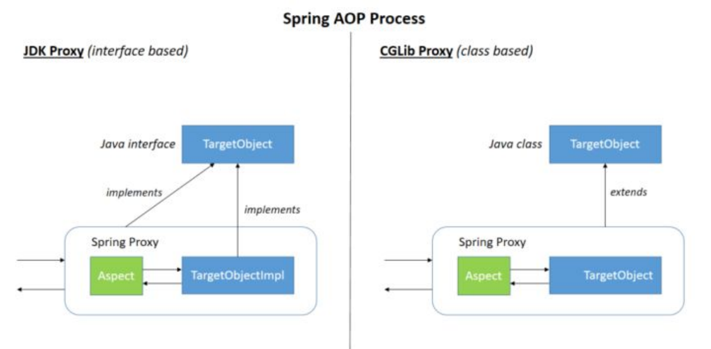
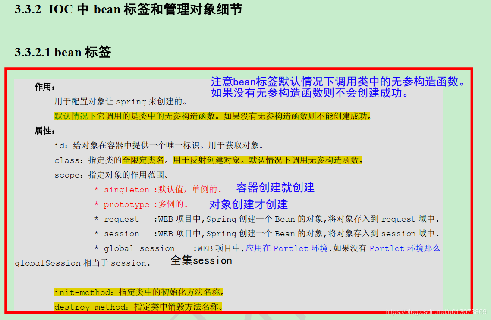
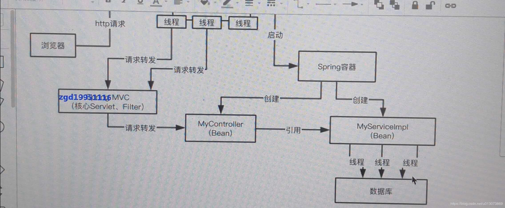
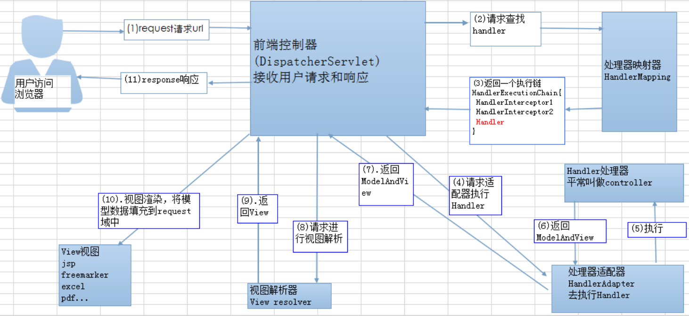
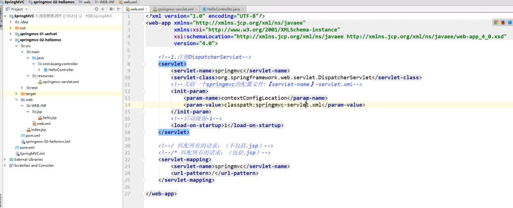
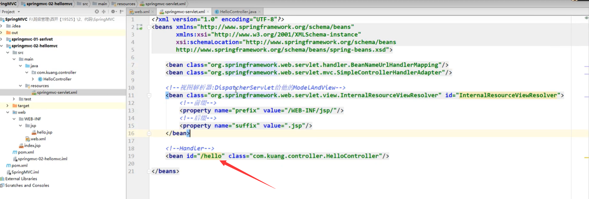
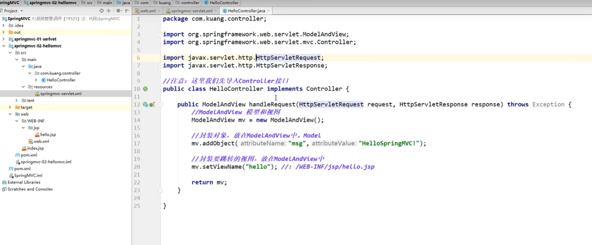

​		Spring Framework 简称 Spring，是 Java 开发中最常用的框架，为了解决企业应用程序开发复杂性而创建的，地位仅次于 Java API，就连近几年比较流行的微服务框架 SpringBoot，也是基于 Spring 实现的，SpringBoot 的诞生是为了让开发者更方便地使用 Spring，因此 Spring 在 Java 体系中的地位可谓首屈一指。

### 01.说说你对Spring的IOC机制的理解可以嘛？

**程序的耦合和解耦   IOC叫控制反转其目的就是为了降低程序的耦合性**，使类与类之间彻底的解耦合（现在这套比较高大上的一点系统里，有几十个类都使用了@Resource或者@Autowired这个注解去标注MyService  myService， 几十个地方都依赖了这个类，如果要修改实现类为NewServiceManagerlmpl，此时只需要将MyService中注解@Service加到NewServiceManagerlmpl中即可 ），不是什么技术，而是一种设计思想。**在Java开发中**，Ioc意味着将你设计好的对象交给容器控制，而不是传统的在你的对象内部直接控制。比如，某个实现类注解@Service  而控制层代码

```java
@Autowired
private IAccountCustomerService accountCustomerService;
```

此时就会把service注入到控制层中。





### 依赖注入（DI）

依赖注入（Dependency Injection，DI），是组件之间依赖关系由容器在运行期决定，即由容器动态的将某个依赖关系注入到组件之中。依赖注入的目的并非为软件系统带来更多功能，而是为了提升组件重用的频率，并为系统搭建一个灵活、可扩展的平台。通过依赖注入机制，只需要通过简单的配置，而无需任何代码就可指定目标需要的资源，完成自身的业务逻辑，而不需要关心具体的资源来自何处，由谁实现。

**依赖注入的常见实现方式**

- setter 注入
- 构造方法注入
- 注解注入

**1.setter 注入**

Java代码：

```java
public class UserController {
    // 注入 UserService 对象
    private UserService userService;
    public void setUserService(UserService userService){
        this.userService = userService;
    }
}
```

XML配置：

```XML
<bean name="userController" class="com.learning.controller.UserController">  
    <!-- 依赖注入 -->  
    <property name="userService" ref="userService"></property>  
</bean>  
<bean name="userService" class="com.learning.dao.impl.UserServiceImpl"></bean>
```

Bean 标签的常用属性说明：

id：为实例化对象起名称，根据 id 值可以得到我们配置的实例化对象，id 属性的名称原则上可以任意命名，但是能包含任何特殊符号；
class：创建对象所在类的全路径；
name：功能和 id 属性一样，但是现在一般不用；与 id 的区别在于：name 属性值里可以包含特殊符号，但是 id 不可以；
scope：一般最常用的有两个值： Singleton：单例模式，整个应用程序，只创建 bean 的一个实例；Prototype：原型模式，每次注入都会创建一个新的 bean 实例，Spring 默认的是单例模式。

**2.构造方法注入**

Java 代码：

```java
public class UserController {
    private UserService userService;
    public UserController(UserService userService){
        this.userService = userService;
    }
}
```

XML配置：

```xml
<bean name="userController" class="com.learning.controller.UserController">  
    <!-- 依赖注入 -->  
    <constructor-arg ref="userService"></constructor-arg>  
</bean>  
<bean name="userService" class="com.learning.dao.impl.UserServiceImpl"></bean>  
```

**3.注解注入**

```java
@Controller
public class UserController {
    // 使用注解自动注入
    @Autowired()
    private UserService userService;
    // do something
}
// 创建依赖对象
@Service
public class UserService {
   // do something 
}
```

创建依赖对象的常见注解：@Component、@Controller、@Service、@Repository。

总结：可以看出注解的方式要比传统的 XML（setter 和构造器注入）实现注入更为方便，同时注解方式也是官方力推的依赖注入最佳使用方式。

### 02.说说你对spring的AOP机制的理解？

​		AOP(Aspect-Oriented Programming:面向切面编程)能够将那些与业务无关，却为业务模块所共同调用的逻辑或责任(例如事务处理、日志管理、权限控制等)封装起来，便于减少系统的重复代码，降低模块间的耦合度，并有利于未来的可拓展性和可维护性。

**AOP 使用场景** : 日志系统 、安全统一效验

​		Spring AOP就是基于动态代理的，如果要代理的对象，实现了某个接口，那么SpringAOP会使用JDK Proxy,去创建代理对象，而对于没有实现接口的对象，就无法使用JDKProxy去进行代理了，这时候Spring AOP会使用Cglib，这时候Spring AOP会使用Cglib生成一个被代理对象的子类来作为代理，如下图所示:



**Spring AOP and AspectJ AOP 有什么区别？AOP 有哪些实现方式？**

AOP实现的关键在于 代理模式，AOP代理主要分为静态代理和动态代理。**静态代理的代表为AspectJ**；**动态代理则以Spring AOP为代表**。

（1）AspectJ是静态代理的增强，所谓静态代理，就是AOP框架会在编译阶段生成AOP代理类，因此也称为编译时增强，他会在编译阶段将AspectJ(切面)织入到Java字节码中，运行的时候就是增强之后的AOP对象。

（2）Spring AOP使用的动态代理，所谓的动态代理就是说AOP框架不会去修改字节码，而是每次运行时在内存中临时为方法生成一个AOP对象，这个AOP对象包含了目标对象的全部方法，并且在特定的切点做了增强处理，并回调原对象的方法。

**AOP 代码实现**

  AOP 的示例就以开车为例，开车的完成流程是这样的：巡视车体及周围情况 → 发动 → 开车 → 熄火 → 锁车。当然我们的主要目的是“开车”，但在开车之前和开完车之后，我们要做一些其他的工作，这些“其他”的工作，可以理解为 AOP 编程。

**1.创建类和方法**

```java
package com.learning.aop;
import org.springframework.stereotype.Component;

@Component("person")
public class Person {
    public void drive() {
        System.out.println("开车");
    }
}

```

**2.创建 AOP 拦截**

```java
package com.learning.aop;

import org.aspectj.lang.annotation.After;
import org.aspectj.lang.annotation.Aspect;
import org.aspectj.lang.annotation.Before;
import org.springframework.stereotype.Component;

@Component
@Aspect
public class CarAop {
    @Before("execution(* com.learning.aop.Person.drive())")
    public void before() {
        System.out.println("巡视车体及周围情况");
        System.out.println("发动");
    }
    @After("execution(* com.learning.aop.Person.drive())")
    public void after() {
        System.out.println("熄火");
        System.out.println("锁车");
    }
}
```

**3.XML 配置注入扫描包路径**

```xml
<?xml version="1.0" encoding="UTF-8"?>
<beans xmlns="http://www.springframework.org/schema/beans"
       xmlns:xsi="http://www.w3.org/2001/XMLSchema-instance"
       xmlns:context="http://www.springframework.org/schema/context"
       xmlns:aop="http://www.springframework.org/schema/aop"
       xsi:schemaLocation="http://www.springframework.org/schema/beans
       http://www.springframework.org/schema/beans/spring-beans.xsd http://www.springframework.org/schema/context http://www.springframework.org/schema/context/spring-context.xsd http://www.springframework.org/schema/aop http://www.springframework.org/schema/aop/spring-aop.xsd">
    <context:component-scan base-package="com.learning"/>
    <aop:aspectj-autoproxy/>
</beans>

```

**4.创建测试类**

```java
package com.learning.aop;

import org.springframework.context.ApplicationContext;
import org.springframework.context.support.ClassPathXmlApplicationContext;

public class PersonTest {
    public static void main(String[] args) {
        ApplicationContext context =
                new ClassPathXmlApplicationContext("applicationContext.xml");
        Person landlord = context.getBean("person", Person.class);
        landlord.drive();
    }
}

```

运行测试代码，执行结果如下：

```java
巡视车体及周围情况

发动

开车

熄火

锁车
```

AspectJ 注解说明：

@Before — 前置通知，在连接点方法前调用；
@Around — 环绕通知，它将覆盖原有方法，但是允许你通过反射调用原有方法；
@After — 后置通知，在连接点方法后调用；
@AfterReturning返回通知，在连接点方法执行并正常返回后调用，要求连接点方法在执行过程中没有发生异常；
@AfterThrowing — 异常通知，当连接点方法异常时调用。

### 03.了解过cglib动态代理吗？他跟jdk动态代理的区别是什么？

Spring AOP中的动态代理主要有两种方式，JDK动态代理和CGLIB动态代理：

1. JDK动态代理只提供接口的代理，不支持类的代理。核心InvocationHandler接口和Proxy类，InvocationHandler 通过invoke()方法反射来调用目标类中的代码，动态地将横切逻辑和业务编织在一起；接着，Proxy利用 InvocationHandler动态创建一个符合某一接口的的实例, 生成目标类的代理对象。
2. 如果代理类没有实现 InvocationHandler 接口，那么Spring AOP会选择使用CGLIB来动态代理目标类。CGLIB（Code Generation Library），是一个代码生成的类库，可以在运行时动态的生成指定类的一个子类对象，并覆盖其中特定方法并添加增强代码，从而实现AOP。CGLIB是通过继承的方式做的动态代理，因此如果某个类被标记为final，那么它是无法使用CGLIB做动态代理的。
   

### 04.能说说Spring中的Bean是线程安全的吗？

Spring容器中的Bean是否线程安全，容器本身并没有提供Bean的线程安全策略，因此可以说**Spring容器中的Bean本身不具备线程安全的特性**，但是具体还是要结合具体作用域(scope)的Bean去研究。

**Spring中的bean的作用域(scope)有哪些?**
● singleton : 单例，默认作用域。
● prototype : 原型，原型每次请求都会创建一个 新的bean实例。
● request : 请求，每一次HTTP请求都会产生一个新的bean，该bean仅 在当前HTTP request内有效。
●session : 会话，每一次HTTP请求都会产生一个新的bean， 该bean仅在当前HTTP session内有效。
● global-session : 全局session作用域，仅仅在基于portlet的web应用中才有意义，Spring5已经没有了。Portlet是 能够生成语义代码(例如: HTML)片段的小型ava Web插件。它们基于portlet容器，可以像servlet一样处理HTTP请求。但是，与servlet不同，每个portlet都有不同的会话。

​		大部分时候我们并没有在系统中使用多线程，所以很少有人会关注这个问题。**单例bean存在线程问题**，主要是因为当多个线程操作同一个对象的时候，对这个对象的非静态成员变量的写操作**会存在线程安全问题**。
常见的有两种解决办法:
1.在Bean对象中尽量避免定义可变的成员变量(不太现实)。
2.在类中定义一个ThreadLocal成员变量，将需要的可变成员变量保存在
ThreadLocal中(推荐的一种方式)





是线程不安全的。spring bean默认来说是单例的，是线程不安全的。但是java web系统中，一般来说很少在spring bean中放一些实例变量，通常都是多个组件互相调用，最终去访问数据库的，所以一般结果就是多个线程并发的访问数据库。

### 05.Spring的事务实现原理是什么？能聊聊你对事务传播机制的理解么？

**事务的实现原理**：如果说你加了一个@Transactional注解，此时spring就会使用AOP的思想，对你的这个方法在执行之前去开启事务，执行完毕之后，根据你方法是否报错，来决定回滚还是提交事务。

**支持当前事务的情况:**

●TransactionDefinition.PROPAGATION_ REQUIRED: 如果当前存在事务， 则加入该事务;如果当前没有事务，则创建一个新的事务。

●TransactionDefinition.PROPAGATION_ SUPPORTS: 如果当前存在事务，则加入该事务;如果当前没有事务，则以非事务的方式继续运行。

●TransactionDefinition.PROPAGATION_ MANDATORY: 如果当前存在事务，则加入该事务;如果当前没有事务，则抛出异常。(mandatory: 强制性)

**不支持当前事务的情况:**

●TransactionDefinition.PROPAGATION_ REQUIRES_ NEW:创建一个新的事务，如果当前存在事务，则把当前事务挂起。

●TransactionDefinition.PROPAGATION_ NOT_ SUPPORTED: 以非事务方式运行，如果当前存在事务，则把当前事务挂起。

●TransactionDefinition.PROPAGATION_ NEVER: 以非事务方式运行，如果当前存在事务，则抛出异常。

**其他情况**（嵌套：方法A调用方法B, 如果B出错，方法B只能回滚他自己，方法A则会可以带着方法B一起回滚，NESTED嵌套事务。）:

●TransactionDefinition.PROPAGATION_ NESTED: 如果当前存在事务，则创
建一个事务作为当前事务的嵌套事务来运行;如果当前没有事务，则该取值等价于
TransactionDefinition.PROPAGATION_ REQUIRED。

### 06.画一张图说说spring boot的核心框架？

**1、什么是 Spring Boot？**

Spring Boot 是 Spring 开源组织下的子项目，是 Spring 组件一站式解决方案，主要是简化了使用 Spring 的难度，简省了繁重xml的配置，提供了各种启动器，在运行过程中自定配置, 开发者能快速上手。

**2、为什么要用 Spring Boot？**

Spring Boot 主要有如下优点：

- 容易上手，提升开发效率，为 Spring 开发提供一个更快、更广泛的入门体验。
- 开箱即用，远离繁琐的配置。
- 提供了一系列大型项目通用的非业务性功能，例如：内嵌服务器、安全管理、运行数据监控、运行状况检查和外部化配置等。
- 没有代码生成，也不需要XML配置。
- 避免大量的 Maven 导入和各种版本冲突。

**3、Spring Boot 的核心注解是哪个？它主要由哪几个注解组成的？**

启动类上面的注解是@SpringBootApplication，它也是 Spring Boot 的核心注解，主要组合包含了以下 3 个注解：

@SpringBootConfiguration：组合了 @Configuration 注解，实现配置文件的功能。

@EnableAutoConfiguration：打开自动配置的功能，也可以关闭某个自动配置的选项，如关闭数据源自动配置功能： @SpringBootApplication(exclude = { DataSourceAutoConfiguration.class })。

@ComponentScan：Spring组件扫描

**4、Spring Boot 的配置文件有哪几种格式？它们有什么区别？**

.properties 和 .yml，它们的区别主要是书写格式不同。YAML 是一种人类可读的数据序列化语言。那么 YAML 配置和传统的 properties 配置相比到底有哪些优势呢？

1. 配置有序，在一些特殊的场景下，配置有序很关键
2. 支持数组，数组中的元素可以是基本数据类型也可以是对象
3. 简洁

**5、Spring Boot 是否可以使用xml配置？**

spring boot推荐使用java配置而非xml，但是Spring Boot中也可以使用XML配置，通过@ImportResource注解引入一个XML配置。

**6、spring boot核心配置文件是什么？**

核心配置文件为application.properties和bootstrap. properties。单纯做 Spring Boot 开发，可能不太容易遇到 bootstrap.properties 配置文件，但是在结合 Spring Cloud 时，这个配置就会经常遇到了，特别是在需要加载一些远程配置文件的时侯。

spring boot 核心的两个配置文件：

- bootstrap (. yml 或者 . properties)：boostrap 由父 ApplicationContext 加载的，比 applicaton 优先加载，配置在应用程序上下文的引导阶段生效。一般来说我们在 Spring Cloud Config 或者 Nacos 中会用到它。且 boostrap 里面的属性不能被覆盖；
- application (. yml 或者 . properties)： 由ApplicatonContext 加载，用于 spring boot 项目的自动化配置。

**7、 什么是Spring Profiles？**

Spring Profiles 允许用户根据配置文件（dev，test，prod 等）来注册 bean。因此，当应用程序在开发中运行时，只有某些 bean 可以加载，而在 PRODUCTION中，某些其他 bean 可以加载。假设我们的要求是 Swagger 文档仅适用于 QA 环境，并且禁用所有其他文档。这可以使用配置文件来完成。Spring Boot 使得使用配置文件非常简单。

**什么是 Swagger？你用 Spring Boot 实现了它吗？**

Swagger 广泛用于可视化 API，使用 Swagger UI 为前端开发人员提供在线沙箱。Swagger 是用于生成 RESTful Web 服务的可视化表示的工具，规范和完整框架实现。它使文档能够以与服务器相同的速度更新。当通过 Swagger 正确定义时，消费者可以使用最少量的实现逻辑来理解远程服务并与其进行交互。因此，Swagger消除了调用服务时的猜测。

**前后端分离，如何维护接口文档 ?**

前后端分离开发日益流行，大部分情况下，我们都是通过 Spring Boot 做前后端分离开发，前后端分离一定会有接口文档，不然会前后端会深深陷入到扯皮中。一个比较笨的方法就是使用 word 或者 md 来维护接口文档，但是效率太低，接口一变，所有人手上的文档都得变。在 Spring Boot 中，这个问题常见的解决方案是 Swagger ，使用 Swagger 我们可以快速生成一个接口文档网站，接口一旦发生变化，文档就会自动更新，所有开发工程师访问这一个在线网站就可以获取到最新的接口文档，非常方便。

**如何重新加载 Spring Boot 上的更改，而无需重新启动服务器？Spring Boot项目如何热部署？**

这可以使用 DEV 工具来实现。通过这种依赖关系，您可以节省任何更改，嵌入式tomcat 将重新启动。Spring Boot 有一个开发工具（DevTools）模块，它有助于提高开发人员的生产力。Java 开发人员面临的一个主要挑战是将文件更改自动部署到服务器并自动重启服务器。开发人员可以重新加载 Spring Boot 上的更改，而无需重新启动服务器。这将消除每次手动部署更改的需要。Spring Boot 在发布它的第一个版本时没有这个功能。这是开发人员最需要的功能。DevTools 模块完全满足开发人员的需求。该模块将在生产环境中被禁用。它还提供 H2 数据库控制台以更好地测试应用程序。

```xm
<dependency>
    <groupId>org.springframework.boot</groupId>
    <artifactId>spring-boot-devtools</artifactId>
</dependency>

```

**Spring Boot 中的 starter 到底是什么 ?**

​		首先，这个 Starter 并非什么新的技术点，基本上还是基于 Spring 已有功能来实现的。首先它提供了一个自动化配置类，一般命名为 XXXAutoConfiguration ，在这个配置类中通过条件注解来决定一个配置是否生效（条件注解就是 Spring 中原本就有的），然后它还会提供一系列的默认配置，也允许开发者根据实际情况自定义相关配置，然后通过类型安全的属性注入将这些配置属性注入进来，新注入的属性会代替掉默认属性。正因为如此，很多第三方框架，我们只需要引入依赖就可以直接使用了。当然，开发者也可以自定义 Starter

**spring-boot-starter-parent 有什么用 ?**

​		我们都知道，新创建一个 Spring Boot 项目，默认都是有 parent 的，这个 parent 就是 spring-boot-starter-parent ，spring-boot-starter-parent 主要有如下作用：

- 定义了 Java 编译版本为 1.8 。
- 使用 UTF-8 格式编码。
- 继承自 spring-boot-dependencies，这个里边定义了依赖的版本，也正是因为继承了这个依赖，所以我们在写依赖时才不需要写版本号。
- 执行打包操作的配置。
- 自动化的资源过滤。
- 自动化的插件配置。

针对 application.properties 和 application.yml 的资源过滤，包括通过 profile 定义的不同环境的配置文件，例如 application-dev.properties 和 application-dev.yml。

**Spring Boot 打成的 jar 和普通的 jar 有什么区别 ?**

Spring Boot 项目最终打包成的 jar 是可执行 jar ，这种 jar 可以直接通过 java -jar xxx.jar 命令来运行，这种 jar 不可以作为普通的 jar 被其他项目依赖，即使依赖了也无法使用其中的类。

Spring Boot 的 jar 无法被其他项目依赖，主要还是他和普通 jar 的结构不同。普通的 jar 包，解压后直接就是包名，包里就是我们的代码，而 Spring Boot 打包成的可执行 jar 解压后，在 \BOOT-INF\classes 目录下才是我们的代码，因此无法被直接引用。如果非要引用，可以在 pom.xml 文件中增加配置，将 Spring Boot 项目打包成两个 jar ，一个可执行，一个可引用。

**运行 Spring Boot 有哪几种方式？**

1）打包用命令或者放到容器中运行

2）用 Maven/ Gradle 插件运行

3）直接执行 main 方法运行

Spring Boot 需要独立的容器运行吗？
可以不需要，内置了 Tomcat/ Jetty 等容器。

**开启 Spring Boot 特性有哪几种方式？**

1）继承spring-boot-starter-parent项目

2）导入spring-boot-dependencies项目依赖

**如何使用 Spring Boot 实现异常处理？**

Spring 提供了一种使用 ControllerAdvice 处理异常的非常有用的方法。 我们通过实现一个 ControlerAdvice 类，来处理控制器类抛出的所有异常。

**如何使用 Spring Boot 实现分页和排序？**

使用 Spring Boot 实现分页非常简单。使用 Spring Data-JPA 可以实现将可分页的传递给存储库方法。

**微服务中如何实现 session 共享 ?**

在微服务中，一个完整的项目被拆分成多个不相同的独立的服务，各个服务独立部署在不同的服务器上，各自的 session 被从物理空间上隔离开了，但是经常，我们需要在不同微服务之间共享 session ，常见的方案就是 Spring Session + Redis 来实现 session 共享。将所有微服务的 session 统一保存在 Redis 上，当各个微服务对 session 有相关的读写操作时，都去操作 Redis 上的 session 。这样就实现了 session 共享，Spring Session 基于 Spring 中的代理过滤器实现，使得 session 的同步操作对开发人员而言是透明的，非常简便。

**Spring Boot 中如何实现定时任务 ?**

定时任务也是一个常见的需求，Spring Boot 中对于定时任务的支持主要还是来自 Spring 框架。

在 Spring Boot 中使用定时任务主要有两种不同的方式，一个就是使用 Spring 中的 @Scheduled 注解，另一个则是使用第三方框架 Quartz。

使用 Spring 中的 @Scheduled 的方式主要通过 @Scheduled 注解来实现。

使用 Quartz ，则按照 Quartz 的方式，定义 Job 和 Trigger 即可。

### 07.能说说Spring中使用了哪些设计模式吗？

[设计模式大全](https://www.runoob.com/design-pattern/observer-pattern.html)

**总结**Spring 框架中用到了哪些设计模式：

- **工厂设计模式** : Spring使用工厂模式通过 `BeanFactory`、`ApplicationContext` 创建 bean 对象。
- **代理设计模式** : Spring AOP 功能的实现。
- **单例设计模式** : Spring 中的 Bean 默认都是单例的。
- **模板方法模式** : Spring 中 `jdbcTemplate`、`hibernateTemplate` 等以 Template 结尾的对数据库操作的类，它们就使用到了模板模式。
- **包装器设计模式** : 我们的项目需要连接多个数据库，而且不同的客户在每次访问中根据需要会去访问不同的数据库。这种模式让我们可以根据客户的需求能够动态切换不同的数据源。
- **观察者模式:** Spring 事件驱动模型就是观察者模式很经典的一个应用。
- **适配器模式** :Spring AOP 的增强或通知(Advice)使用到了适配器模式、spring MVC 中也是用到了适配器模式适配`Controller`。

------

**工厂设计模式**

​		Spring使用工厂模式可以通过 `BeanFactory` 或 `ApplicationContext` 创建 bean 对象。

**两者对比：**

- `BeanFactory` ：延迟注入(使用到某个 bean 的时候才会注入),相比于`BeanFactory`来说会占用更少的内存，程序启动速度更快。
- `ApplicationContext` ：容器启动的时候，不管你用没用到，一次性创建所有 bean 。`BeanFactory` 仅提供了最基本的依赖注入支持，`ApplicationContext` 扩展了 `BeanFactory` ,除了有`BeanFactory`的功能还有额外更多功能，所以一般开发人员使用`ApplicationContext`会更多。

ApplicationContext的三个实现类：

1. `ClassPathXmlApplication`：把上下文文件当成类路径资源。
2. `FileSystemXmlApplication`：从文件系统中的 XML 文件载入上下文定义信息。
3. `XmlWebApplicationContext`：从Web系统中的XML文件载入上下文定义信息。

Example:

```java
import org.springframework.context.ApplicationContext;
import org.springframework.context.support.FileSystemXmlApplicationContext;

public class App {
    public static void main(String[] args) {
        ApplicationContext context = new FileSystemXmlApplicationContext(
                "C:/work/IOC Containers/springframework.applicationcontext/src/main/resources/bean-factory-config.xml");

        HelloApplicationContext obj = (HelloApplicationContext) context.getBean("helloApplicationContext");
        obj.getMsg();
    }
}
```

------

**单例设计模式**

​		在我们的系统中，有一些对象其实我们只需要一个，比如说：线程池、缓存、对话框、注册表、日志对象、充当打印机、显卡等设备驱动程序的对象。事实上，这一类对象只能有一个实例，如果制造出多个实例就可能会导致一些问题的产生，比如：程序的行为异常、资源使用过量、或者不一致性的结果。

**使用单例模式的好处:**

- 对于频繁使用的对象，可以省略创建对象所花费的时间，这对于那些重量级对象而言，是非常可观的一笔系统开销；
- 由于 new 操作的次数减少，因而对系统内存的使用频率也会降低，这将减轻 GC 压力，缩短 GC 停顿时间。

**Spring 中 bean 的默认作用域就是 singleton(单例)的。** 除了 singleton 作用域，Spring 中 bean 还有下面几种作用域：

- prototype : 每次请求都会创建一个新的 bean 实例。
- request : 每一次HTTP请求都会产生一个新的bean，该bean仅在当前HTTP request内有效。
- session : 每一次HTTP请求都会产生一个新的 bean，该bean仅在当前 HTTP session 内有效。
- global-session： 全局session作用域，仅仅在基于portlet的web应用中才有意义，Spring5已经没有了。Portlet是能够生成语义代码(例如：HTML)片段的小型Java Web插件。它们基于portlet容器，可以像servlet一样处理HTTP请求。但是，与 servlet 不同，每个 portlet 都有不同的会话

**Spring 实现单例的方式：**

- xml:<bean id="userService" class="top.snailclimb.UserService" scope="singleton"/>
- 注解：`@Scope(value = "singleton")`

Spring 通过 `ConcurrentHashMap` 实现单例注册表的特殊方式实现单例模式。Spring 实现单例的核心代码如下：

```java
// 通过 ConcurrentHashMap（线程安全） 实现单例注册表
private final Map<String, Object> singletonObjects = new ConcurrentHashMap<String, Object>(64);

public Object getSingleton(String beanName, ObjectFactory<?> singletonFactory) {
        Assert.notNull(beanName, "'beanName' must not be null");
        synchronized (this.singletonObjects) {
            // 检查缓存中是否存在实例  
            Object singletonObject = this.singletonObjects.get(beanName);
            if (singletonObject == null) {
                //...省略了很多代码
                try {
                    singletonObject = singletonFactory.getObject();
                }
                //...省略了很多代码
                // 如果实例对象在不存在，我们注册到单例注册表中。
                addSingleton(beanName, singletonObject);
            }
            return (singletonObject != NULL_OBJECT ? singletonObject : null);
        }
    }
    //将对象添加到单例注册表
    protected void addSingleton(String beanName, Object singletonObject) {
            synchronized (this.singletonObjects) {
                this.singletonObjects.put(beanName, (singletonObject != null ? singletonObject : NULL_OBJECT));

            }
        }
}
```

------

**代理设计模式**

**代理模式在 AOP 中的应用**

​		AOP(Aspect-Oriented Programming:面向切面编程)能够将那些与业务无关，却为业务模块所共同调用的逻辑或责任（例如事务处理、日志管理、权限控制等）封装起来，便于减少系统的重复代码，降低模块间的耦合度，并有利于未来的可拓展性和可维护性。

​		**Spring AOP 就是基于动态代理的**，如果要代理的对象，实现了某个接口，那么Spring AOP会使用**JDK Proxy**，去创建代理对象，而对于没有实现接口的对象，就无法使用 JDK Proxy 去进行代理了，这时候Spring AOP会使用**Cglib** ，这时候Spring AOP会使用 **Cglib** 生成一个被代理对象的子类来作为代理，如下图所示：

SpringAOPProcess

​		当然你也可以使用 AspectJ ,Spring AOP 已经集成了AspectJ ，AspectJ 应该算的上是 Java 生态系统中最完整的 AOP 框架了。

​		使用 AOP 之后我们可以把一些通用功能抽象出来，在需要用到的地方直接使用即可，这样大大简化了代码量。我们需要增加新功能时也方便，这样也提高了系统扩展性。日志功能、事务管理等等场景都用到了 AOP 。

------

**适配器模式**

​		适配器模式(Adapter Pattern) 将一个接口转换成客户希望的另一个接口，适配器模式使接口不兼容的那些类可以一起工作，其别名为包装器(Wrapper)。

**spring AOP中的适配器模式**

​		我们知道 Spring AOP 的实现是基于代理模式，但是 Spring AOP 的增强或通知(Advice)使用到了适配器模式，与之相关的接口是`AdvisorAdapter` 。Advice 常用的类型有：`BeforeAdvice`（目标方法调用前,前置通知）、`AfterAdvice`（目标方法调用后,后置通知）、`AfterReturningAdvice`(目标方法执行结束后，return之前)等等。每个类型Advice（通知）都有对应的拦截器:`MethodBeforeAdviceInterceptor`、`AfterReturningAdviceAdapter`、`AfterReturningAdviceInterceptor`。Spring预定义的通知要通过对应的适配器，适配成 `MethodInterceptor`接口(方法拦截器)类型的对象（如：`MethodBeforeAdviceInterceptor` 负责适配 `MethodBeforeAdvice`）。

**spring MVC中的适配器模式**

​		在Spring MVC中，`DispatcherServlet` 根据请求信息调用 `HandlerMapping`，解析请求对应的 `Handler`。解析到对应的 `Handler`（也就是我们平常说的 `Controller` 控制器）后，开始由`HandlerAdapter` 适配器处理。`HandlerAdapter` 作为期望接口，具体的适配器实现类用于对目标类进行适配，`Controller` 作为需要适配的类。

**为什么要在 Spring MVC 中使用适配器模式？** Spring MVC 中的 `Controller` 种类众多，不同类型的 `Controller` 通过不同的方法来对请求进行处理。如果不利用适配器模式的话，`DispatcherServlet` 直接获取对应类型的 `Controller`，需要的自行来判断，像下面这段代码一样：

```java
if(mappedHandler.getHandler() instanceof MultiActionController){  
   ((MultiActionController)mappedHandler.getHandler()).xxx  
}else if(mappedHandler.getHandler() instanceof XXX){  
    ...  
}else if(...){  
   ...  
} 
```

​		假如我们再增加一个 `Controller`类型就要在上面代码中再加入一行 判断语句，这种形式就使得程序难以维护，也违反了设计模式中的开闭原则 – 对扩展开放，对修改关闭。

------

**观察者模式**

观察者模式是一种对象行为型模式。它表示的是一种对象与对象之间具有依赖关系，当一个对象发生改变的时候，这个对象所依赖的对象也会做出反应。Spring 事件驱动模型就是观察者模式很经典的一个应用。Spring 事件驱动模型非常有用，在很多场景都可以解耦我们的代码。比如我们每次添加商品的时候都需要重新更新商品索引，这个时候就可以利用观察者模式来解决这个问题。

###  09.能说一说springMvc的核心架构么？

​		MVC是一一种设计模式,Spring MVC是一款很优秀的MVC框架。Spring MVC可以帮助我们进行更简洁的Web层的开发，并且它天生与Spring框架集成。Spring MVC下我们一般把后端项目分为Service层(业务层 处理业务)、Dao层(持久层 数据库操作)、Entity层 (实体层 数据库在项目中的类)、Controller层(控制层，返回数据给前台页面)。原理如下图：




**流程说明(重要) :**

1. 客户端(浏览器)发送请求，直接请求到DispatcherServlet （前端控制器） (图demo图1)。

2. DispatcherServlet根据请求信息调用HandlerMapping （处理器映射）（配置文件如下图demo图2）,解析url请求对应的Handler (Controller控制器 demo图3)。
3. 解析到对应的Handler (也就是我们平常说的Controller控制器)后，开始由HandlerAdapter 适配器处理（去找Controller）。

4. HandlerAdapter会根据Handler(Controller控制器)来调用真正的处理器开处理请求，并处理相应的业务逻辑（demo中没有业务层）。
5. 处理器处理完业务后，会返回一个ModeLAndView对象（给HandlerAdapter），Model是返回的数据对象，View是个逻辑_上的View。
6. HandlerAdapter将视图逻辑名或者模型传递给DispatcherServlet 
7. DispatcherServlet 调用ViewResolver（视图解析器----1、作用获取ModeLAndView数据 2、解析ModeLAndView的视图名字 3、拼接地址名字  4、将数据渲染到这个视图上）会根据逻辑View查找实际的View.
8. DispaterServlet把返回的Model传给View (视图渲染)。
9. 把View返回给请求者（浏览器）

Spring Boot 的Demo：

第一步注册DispatcherServlet 拦截所有的客户访问。






