### 01.OSI（七层）与TCP/IP（四层）各层的结构与功能

学习计算机网络时我们一般采用折中的办法，也就是中和 OSI 和 TCP/IP 的优点，采用一种只有五层协议的体系结构，这样既简洁又能将概念阐述清楚。

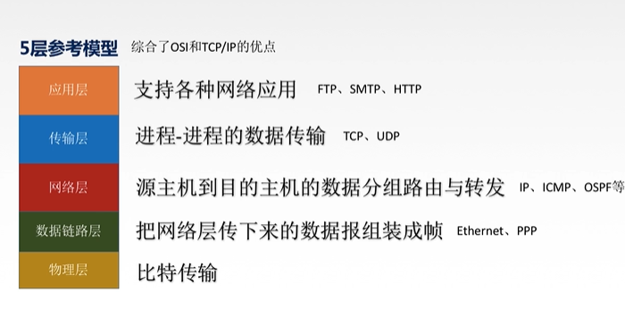

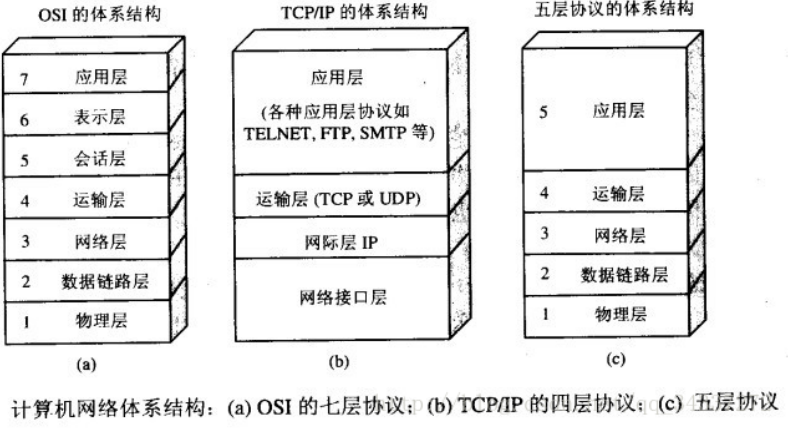

**物理层**：

在物理层是所传数据的单位是比特。 **物理层(physical layer)的作用是实现相邻计算机节点之间比特流的透明传送，尽可能屏蔽掉具体传输介质和物理设备的差异。** 网线、海底电缆统一属于物理层，在物质层面，让电脑之间可以联网，然后传递0/1电路信号；发送方发送1或者0时，接收方应该接收相同的1或者0，因此物理层要考虑用多大的电压代表"1"或者"0", 以及接收方如何识别发送方所发出的比特。物理层还要确定连接电缆的插头应当有多少根引脚以及各引脚如何连接。当然解释比特代表的意思，就不是物理层的任务。请注意，传递信息所利用的一些物理媒体，如双绞线、同轴电缆、光缆、无线信道等，并不是物理层协议之内而是在物理层协议的下面。因此也有人把物理层当做第0层。

**数据链路层**：

一套协议，能够实现将物理层的01信号进行分组等处理，规定电信号的含义是什么。数据链路层通常简称为**链路层。我们知道，两台主机之间的数据传输，总是在一段一段的链路上传送的, 这就需要使用专门的链路层的协议**。在两个相邻结点之间传送数据时，数据链路层量网络层交下来的**IP数据报封装成帧(frameing)**,在两个相邻节点间的链路上传送帧, 每一帧包括数据和必要的**控制信息**(如同步信息、地址信息、差错信息等)。

在接收数据时，控制信息使接收端能够知道一个帧从哪个比特开始到哪个比特结束，这样数据链路层在收到一个帧后，就可从中提取数据部分，上交到网络层。

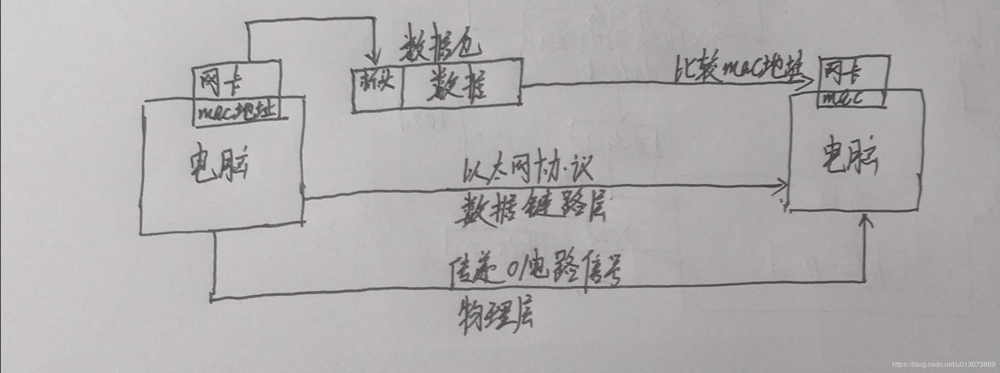

**网络层**：

**网络层负责为分组交换网上的不同主机提供通信服务**。**在计算机网络中进行通信的两个计算机之间可能会经过很多个数据链路，也可能还要经过很多通信子网。网络层的任务就是选择合适的网间路由和交换结点， 确保数据及时传送。** 在发送数据时，网络层把运输层产生的报文段或用户数据报封装成分组和包进行传送。在 TCP/IP 体系结构中，由于网络层使用 **IP 协议**，因此分组也叫 **IP 数据报** ，简称 **数据报**。也就是不同网络下，两台电脑之间链接

**运输层**

**运输层(transport layer)的主要任务就是负责向两台主机进程之间的通信提供通用的数据传输服务**。应用进程利用该服务传送应用层报文。“通用的”是指并不针对某一个特定的网络应用，而是多种应用可以使用同一个运输层服务。由于一台主机可同时运行多个线程，因此运输层有复用和分用的功能。所谓复用就是指多个应用层进程可同时使用下面运输层的服务，分用和复用相反，是运输层把收到的信息分别交付上面应用层中的相应进程。

运输层主要协议 ：传输控制协议TCP；用户数据协议UDP（下面详细说）

**应用层**

**应用层(application-layer）的任务是通过应用进程间的交互来完成特定网络应用。应用层协议定义的是应用进程（进程：主机中正在运行的程序）间的通信和交互的规则**。对于不同的网络应用需要不同的应用层协议。在互联网中应用层协议很多，如域名系统DNS，支持万维网应用的 HTTP协议，支持电子邮件的 **SMTP协议**等等。我们把应用层交互的数据单元称为报文。

域名系统：

域名系统(Domain Name System缩写 DNS，Domain Name被译为域名)是因特网的一项核心服务，它作为可以将域名和IP地址相互映射的一个分布式数据库，能够使人更方便的访问互联网，而不用去记住能够被机器直接读取的IP数串。（百度百科）例如：一个公司的 Web 网站可看作是它在网上的门户，而域名就相当于其门牌地址，通常域名都使用该公司的名称或简称。例如上面提到的微软公司的域名，类似的还有：IBM 公司的域名是 www.ibm.com、Oracle 公司的域名是 www.oracle.com、Cisco公司的域名是 www.cisco.com 等。

HTTP协议：

超文本传输协议（HTTP，HyperText Transfer Protocol)是互联网上应用最为广泛的一种网络协议。所有的 WWW（万维网） 文件都必须遵守这个标准。设计 HTTP 最初的目的是为了提供一种发布和接收 HTML 页面的方法。（百度百科）

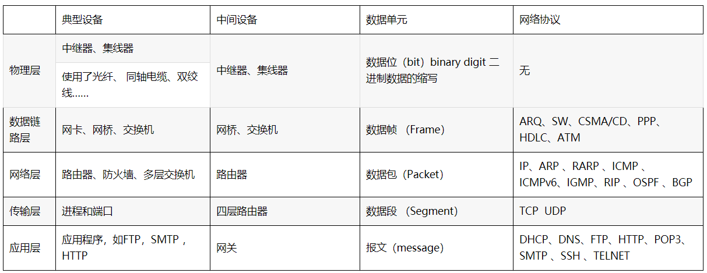

四层网络体系结构多种协议图解

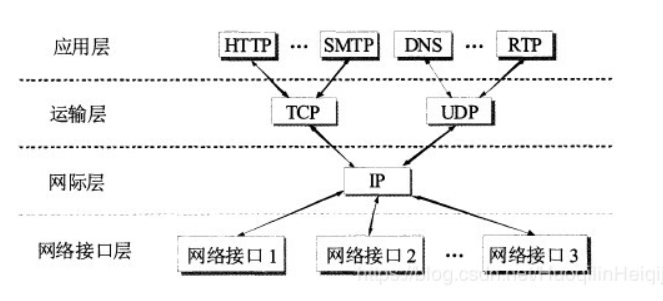

4层：数据链路层（以太网协议） ，网络层（ip协议），传输层（tcp协议 ），应用层（http协议）

7层：物理层，会话层，表示层和会话层合并成应用层。

### 02.TCP，UDP区别

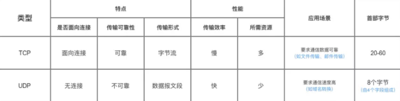

**TCP主要特点**

- TCP面向连接。（就好像打电话一样，通话前需要先拨号建立连接，通话结束后要挂机释放连接）
- 每一条TCP链接只能有两个端点，每一条TCP链接只能是点对点的（一对一）
- TCP提供可靠交付的服务。通过TCP连接传送的数据，无差错、不丢失、不重复、并按需到达。
- TCP 提供全双工通信。TCP 允许通信双方的应用进程在任何时候都能发送数据。TCP 连接的两端都设有发送缓存和接收缓存，用来临时存放双方通信的数据；
- 面向字节流。TCP 中的“流”（Stream）指的是流入进程或从进程流出的字节序列。“面向字节流”的含义是：虽然应用程序和 TCP 的交互是一次一个数据块（大小不等），但 TCP 把应用程序交下来的数据仅仅看成是一连串的无结构的字节流。

TCP一般用于文件传输、发送和接收邮件、远程登陆等场景。

**UDP主要特点**

- UDP是无连接的
- UDP尽最大努力交付，即不保证可靠交付，因为主机不需要维持复杂的链接状态。
- UDP是面向报文的。
- UDP 没有拥塞控制，因此网络出现拥塞不会使源主机的发送速率降低（对实时应用很有用，如 直播，实时视频会议等）（优点）
- UDP 支持一对一、一对多、多对一和多对多的交互通信；
- UDP 的首部开销小，只有8个字节，比TCP的20-60个字节的首部要短。

### 03.TCP三次握手和四次挥手（*）

为了准确无误地把数据送达到目标处，TCP协议采用了三次握手策略。

**TCP三次握手漫画图解**

下面两个机器人通过三次握手确定了对方能正确接受和发送消息。

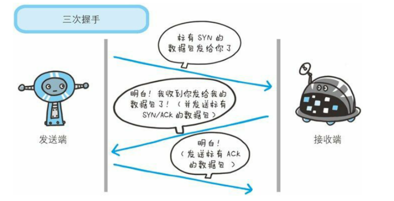

简单示意图：

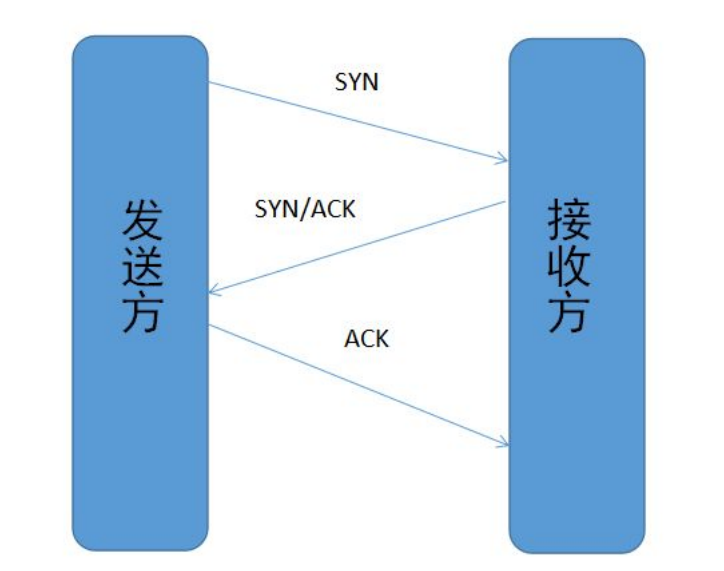

1. 客户端 - 发送带有SYN标志的数据包 - 一次握手 - 服务端
2. 服务端 - 发送带有SYN/ACK标志的数据包 - 二次握手 - 客户端
3. 客户端 - 发送带有ACK标志的数据包 - 的数据包 - 三次握手 - 服务端

**为什么三次握手**

三次握手目的是建立可靠的通信信道，说到通讯，简单的来说就是数据的发送与接受，而三次握手最主要的目的就是双方确定自己与对方的发送与接受是正常的。

第一次握手：Client什么都不能确认；Service确认了对方发送正常，自己接受正常

第二次握手：Client确认了：自己发送、接受正常，对方发送、接收正常；Service确认了：对方发送正常，自己接收正常。

第三次握手：Client确认了：自己发送、接收正常，对方发送、接受正常；Service确认了：自己发送正常、接收正常，对方发送、接收正常。

所以三次握手就能确定双发收发功能都正常，缺一不可。

**为什么传回SYN？以及传回SYN后为什么又传ACK**

接收端传回发送端发送的SYN是为了告诉发送端，我接到的信息确实是你所发送的信号。

双方通信无误必须是两者互相发送信息都无误。传了SYN，证明发送方到接收方的通道没有问题，但接收方到发送方的通道还需要ACK信号来验证。

**TCP四次挥手**

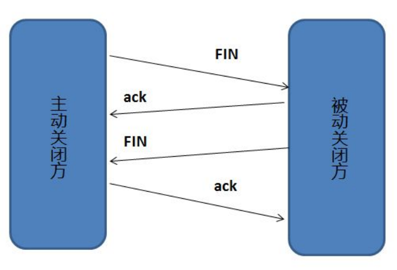

断开TCP连接则需要“四次挥手”：

1. 客户端 - 发送一个FIN，用来关闭客户端到服务器的数据传送。
2. 服务器 - 收到这个FIN，它发挥一个ACK，确认序号为收到的序号加1.和SYN一样，一个FIN将占用一个序号
3. 服务器 - 关闭与客户端的连接，发送FIN给客户端
4. 客户端 - 发挥ACK报文确认，并将确认序号设置为收到序号加1

**为什么要四次挥手**


挥手之前主动释放连接的客户端结束ESTABLISHED阶段。随后开始“四次挥手”：

（1）首先客户端想要释放连接，向服务器端发送一段TCP报文，其中：

- 标记位为FIN，表示“请求释放连接“；
- 序号为Seq=U；
- 随后客户端进入FIN-WAIT-1阶段，即半关闭阶段。并且停止在客户端到服务器端方向上发送数据，但是客户端仍然能接收从服务器端传输过来的数据。

（2）服务器端接收到从客户端发出的TCP报文之后，确认了客户端想要释放连接，随后服务器端结束ESTABLISHED阶段，进入CLOSE-WAIT阶段（半关闭状态）并返回一段TCP报文，其中：

- 标记位为ACK，表示“接收到客户端发送的释放连接的请求”；
- 序号为Seq=V；
- 确认号为Ack=U+1，表示是在收到客户端报文的基础上，将其序号Seq值加1作为本段报文确认号Ack的值；
- 随后服务器端开始准备释放服务器端到客户端方向上的连接。

客户端收到从服务器端发出的TCP报文之后，确认了服务器收到了客户端发出的释放连接请求，随后客户端结束FIN-WAIT-1阶段，进入FIN-WAIT-2阶段；

前"两次挥手"既让服务器端知道了客户端想要释放连接，也让客户端知道了服务器端了解了自己想要释放连接的请求。于是，可以确认关闭客户端到服务器端方向上的连接了。

（3）服务器端自从发出ACK确认报文之后，经过CLOSED-WAIT阶段，做好了释放服务器端到客户端方向上的连接准备，再次向客户端发出一段TCP报文，其中：

- 标记位为FIN，ACK，表示“已经准备好释放连接了”。注意：这里的ACK并不是确认收到服务器端报文的确认报文。
- 序号为Seq=W；
- 确认号为Ack=U+1；表示是在收到客户端报文的基础上，将其序号Seq值加1作为本段报文确认号Ack的值。

随后服务器端结束CLOSE-WAIT阶段，进入LAST-ACK阶段。并且停止在服务器端到客户端的方向上发送数据，但是服务器端仍然能够接收从客户端传输过来的数据。

（4）客户端收到从服务器端发出的TCP报文，确认了服务器端已做好释放连接的准备，结束FIN-WAIT-2阶段，进入TIME-WAIT阶段，并向服务器端发送一段报文，其中：

- 标记位为ACK，表示“接收到服务器准备好释放连接的信号”。
- 序号为Seq=U+1；表示是在收到了服务器端报文的基础上，将其确认号Ack值作为本段报文序号的值。
- 确认号为Ack=W+1；表示是在收到了服务器端报文的基础上，将其序号Seq值作为本段报文确认号的值。

随后客户端开始在TIME-WAIT阶段等待**2MSL**（为的是确认服务器端是否收到客户端发出的ACK确认报文

当客户端发出最后的ACK确认报文时，并不能确定服务器端能够收到该段报文。所以客户端在发送完ACK确认报文之后，会设置一个时长为2MSL的计时器。MSL指的是Maximum Segment Lifetime：一段TCP报文在传输过程中的最大生命周期。2MSL即是服务器端发出为FIN报文和客户端发出的ACK确认报文所能保持有效的最大时长。

服务器端在1MSL内没有收到客户端发出的ACK确认报文，就会再次向客户端发出FIN报文；）


上图有个错误 第二步女人像男人发送的是ACK报文 最后男人向女人发送的是ACK报文

### 04.TCP协议如何保证可靠传输

1. 应用数据被分割成 TCP 认为最适合发送的数据块。
2. TCP 给发送的每一个包进行编号，接收方对数据包进行排序，把有序数据传送给应用层。
3. **校验和：** TCP 将保持它首部和数据的检验和。这是一个端到端的检验和，目的是检测数据在传输过程中的任何变化。如果收到段的检验和有差错，TCP 将丢弃这个报文段和不确认收到此报文段。
4. TCP 的接收端会丢弃重复的数据。
5. **流量控制：** TCP 连接的每一方都有固定大小的缓冲空间，TCP的接收端只允许发送端发送接收端缓冲区能接纳的数据。当接收方来不及处理发送方的数据，能提示发送方降低发送的速率，防止包丢失。TCP 使用的流量控制协议是可变大小的滑动窗口协议。 （TCP 利用滑动窗口实现流量控制）
6. **拥塞控制：** 当网络拥塞时，减少数据的发送。
7. **停止等待协议** 也是为了实现可靠传输的，它的基本原理就是每发完一个分组就停止发送，等待对方确认。在收到确认后再发下一个分组。 **超时重传：** 当 TCP 发出一个段后，它启动一个定时器，等待目的端确认收到这个报文段。如果不能及时收到一个确认，将重发这个报文段。

### 05.在浏览器输入网址->>显示主页的过程

打开一个页面，整个过程使用哪些协议？

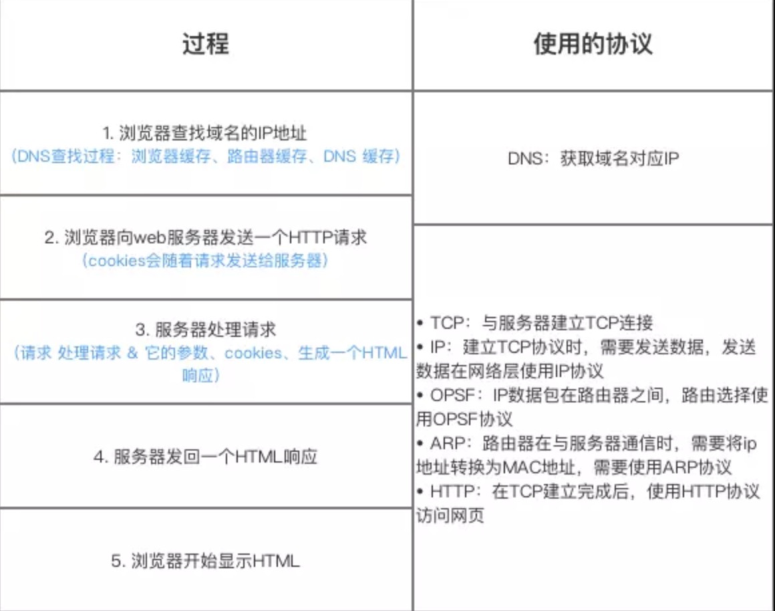

总体来说分为以下几个过程：

1. DNS解析
2. TCP连接
3. 发送HTTP请求
4. 服务器处理请求并返回HTTP报文
5. 浏览器解析渲染页面
6. 连接结束

**各种协议与HTTP协议之间的关系**

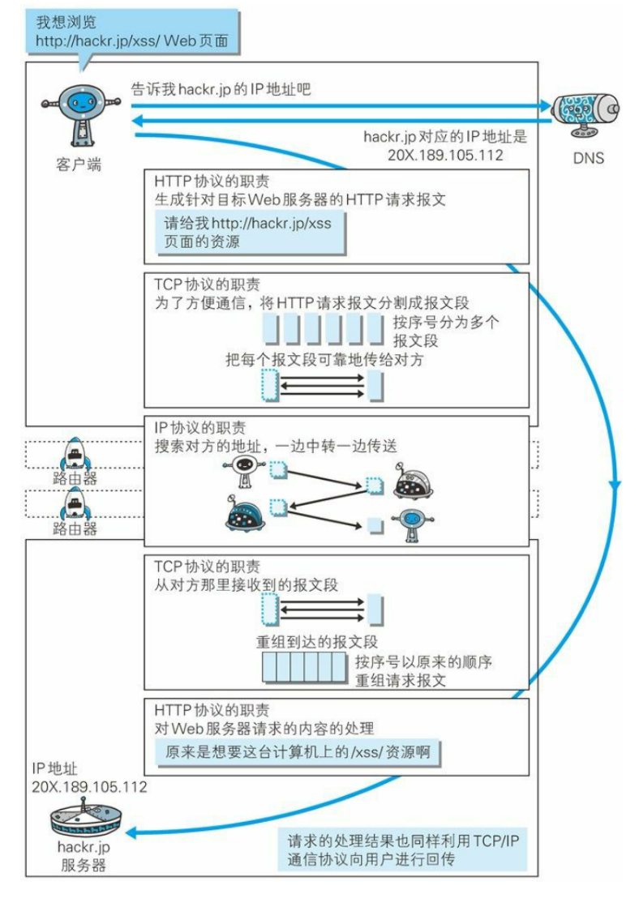

### 06.状态码

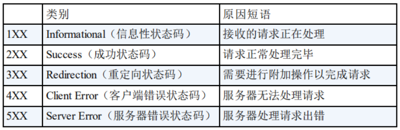

- 100 - 继续。客户端应继续其请求
- 101 - 切换协议。服务器根据客户端的请求切换协议。只能切换到更高级的协议，例如，切换到HTTP的新版本协议
- 200 - 请求成功
- 301 - 资源（网页等）被永久转移到其它URL
- 404 - 请求的资源（网页等）不存在
- 500 - 服务器内部错误，无法完成请求

### 07.HTTP长连接,短连接

在HTTP/1.0中默认使用短连接。也就是说，客户端和服务器每进行一次HTTP操作，就建立一次连接，任务结束就中断连接。当客户端浏览器访问的某个HTML或其他类型的Web页中包含有其他的Web资源（如JavaScript文件、图像文件、CSS文件等），每遇到这样一个Web资源，浏览器就会重新建立一个HTTP会话。

而从HTTP/1.1起，默认使用长连接，用以保持连接特性。使用长连接的HTTP协议，会在响应头加入这行代码：

```
Connection:keep-alive
```

在使用长连接的情况下，当一个网页打开完成后，客户端和服务器之间用于传输HTTP数据的TCP连接不会关闭，客户端再次访问这个服器时，会继续使用这一条已经建立的连接。Keep-Alive不会永久保持连接，它有一个保持时间，可以在不同的服务器软件（如Apache）中设定这个时间。实现长连接需要客户端和服务端都支持长连接。

**HTTP协议的长连接和短连接，实质上是TCP协议的长连接和短连接。**

### 08.HTTP是不保存状态的协议,如何保存用户状态?

**HTTP 是一种不保存状态，即无状态（stateless）协议**。也就是说 HTTP 协议自身不对请求和响应之间的通信状态进行保存。那么我们保存用户状态呢？Session 机制的存在就是为了解决这个问题，**Session 的主要作用就是通过服务端记录用户的状态**。典型的场景是购物车，当你要添加商品到购物车的时候，系统不知道是哪个用户操作的，因为 HTTP 协议是无状态的。服务端给特定的用户创建特定的 Session 之后就可以标识这个用户并且跟踪这个用户了（一般情况下，服务器会在一定时间内保存这个 Session，过了时间限制，就会销毁这个Session）。

在服务端保存 Session 的方法很多，最常用的就是内存和数据库(比如是使用内存数据库redis保存)。既然 Session 存放在服务器端，那么我们如何实现 Session 跟踪呢？大部分情况下，我们都是通过在 Cookie 中附加一个 Session ID 来方式来跟踪。

**Cookie 被禁用怎么办?**

最常用的就是利用 URL 重写把 Session ID 直接附加在URL路径的后面。

[](https://camo.githubusercontent.com/bb933f4dcc039d22ffb579335038fb0e000c7051/68747470733a2f2f6d792d626c6f672d746f2d7573652e6f73732d636e2d6265696a696e672e616c6979756e63732e636f6d2f323031392d362f485454502545362539382541462545362539372541302545372538412542362545362538302538312545372539412538342e706e67)

### 09.Cookie的作用是什么?和Session有什么区别？

Cookie 和 Session都是用来跟踪浏览器用户身份的会话方式，但是两者的应用场景不太一样。

**Cookie 一般用来保存用户信息** 比如①我们在 Cookie 中保存已经登录过得用户信息，下次访问网站的时候页面可以自动帮你登录的一些基本信息给填了；②一般的网站都会有保持登录也就是说下次你再访问网站的时候就不需要重新登录了，这是因为用户登录的时候我们可以存放了一个 Token 在 Cookie 中，下次登录的时候只需要根据 Token 值来查找用户即可(为了安全考虑，重新登录一般要将 Token 重写)；③登录一次网站后访问网站其他页面不需要重新登录。**Session 的主要作用就是通过服务端记录用户的状态。** 典型的场景是购物车，当你要添加商品到购物车的时候，系统不知道是哪个用户操作的，因为 HTTP 协议是无状态的。服务端给特定的用户创建特定的 Session 之后就可以标识这个用户并且跟踪这个用户了。

**Cookie 数据保存在客户端(浏览器端)，Session 数据保存在服务器端。**

Cookie 存储在客户端中，而Session存储在服务器上，相对来说 Session 安全性更高。如果要在 Cookie 中存储一些敏感信息，不要直接写入 Cookie 中，最好能将 Cookie 信息加密然后使用到的时候再去服务器端解密。

### 10.HTTP 1.0和HTTP 1.1的主要区别是什么?

HTTP1.0最早在网页中使用是在1996年，那个时候只是使用一些较为简单的网页上和网络请求上，而HTTP1.1则在1999年才开始广泛应用于现在的各大浏览器网络请求中，同时HTTP1.1也是当前使用最为广泛的HTTP协议。 主要区别主要体现在：

1. **长连接** : **在HTTP/1.0中，默认使用的是短连接**，也就是说每次请求都要重新建立一次连接。HTTP 是基于TCP/IP协议的,每一次建立或者断开连接都需要三次握手四次挥手的开销，如果每次请求都要这样的话，开销会比较大。因此最好能维持一个长连接，可以用个长连接来发多个请求。**HTTP 1.1起，默认使用长连接** ,默认开启Connection： keep-alive。 **HTTP/1.1的持续连接有非流水线方式和流水线方式** 。流水线方式是客户在收到HTTP的响应报文之前就能接着发送新的请求报文。与之相对应的非流水线方式是客户在收到前一个响应后才能发送下一个请求。
2. **错误状态响应码** :在HTTP1.1中新增了24个错误状态响应码，如409（Conflict）表示请求的资源与资源的当前状态发生冲突；410（Gone）表示服务器上的某个资源被永久性的删除。
3. **缓存处理** :在HTTP1.0中主要使用header里的If-Modified-Since,Expires来做为缓存判断的标准，HTTP1.1则引入了更多的缓存控制策略例如Entity tag，If-Unmodified-Since, If-Match, If-None-Match等更多可供选择的缓存头来控制缓存策略。
4. **带宽优化及网络连接的使用** :HTTP1.0中，存在一些浪费带宽的现象，例如客户端只是需要某个对象的一部分，而服务器却将整个对象送过来了，并且不支持断点续传功能，HTTP1.1则在请求头引入了range头域，它允许只请求资源的某个部分，即返回码是206（Partial Content），这样就方便了开发者自由的选择以便于充分利用带宽和连接。

```
http2.0变化巨大。

1 http支持多路复用，同一个连接可以并发处理多个请求，方法是把http数据包拆为多个帧，并发有序的发送，根据序号在另一端进行重组，而不需要一个个http请求顺序到达。

2 http2.0支持服务端推送，就是服务端在http请求到达后，除了返回数据之外，还推送了额外的内容给客户端。

3HTTP2.0压缩了请求头，同时基本单位是二进制帧流，这样的数据占用空间更少。

4http2.0只适用于https场景，因为其在http和tcp中间加了一层ssl层。
```

### 11.URI和URL的区别是什么?

- URI(Uniform Resource Identifier) 是统一资源标志符，可以唯一标识一个资源。
- URL(Uniform Resource Location) 是统一资源定位符，可以提供该资源的路径。它是一种具体的 URI，即 URL 可以用来标识一个资源，而且还指明了如何 locate 这个资源。

URI的作用像身份证号一样，URL的作用更像家庭住址一样。URL是一种具体的URI，它不仅唯一标识资源，而且还提供了定位该资源的信息。

### 12.HTTP 和 HTTPS 的区别？

1. **端口** ：HTTP的URL由“http://”起始且默认使用端口80，而HTTPS的URL由“https://”起始且默认使用端口443。

2. 安全性和资源消耗：

   HTTP协议运行在TCP之上，所有传输的内容都是明文，客户端和服务器端都无法验证对方的身份。HTTPS是运行在SSL/TLS之上的HTTP协议，SSL/TLS 运行在TCP之上。所有传输的内容都经过加密，加密采用对称加密，但对称加密的密钥用服务器方的证书进行了非对称加密。所以说，HTTP 安全性没有 HTTPS高，但是 HTTPS 比HTTP耗费更多服务器资源。

   - 对称加密：密钥只有一个，加密解密为同一个密码，且加解密速度快，典型的对称加密算法有DES、AES等；
   - 非对称加密：密钥成对出现（且根据公钥无法推知私钥，根据私钥也无法推知公钥），加密解密使用不同密钥（公钥加密需要私钥解密，私钥加密需要公钥解密），相对对称加密速度较慢，典型的非对称加密算法有RSA、DSA等。